# ECS架构设计详解

## 概述

Galacean Engine 采用Entity-Component-System（ECS）架构，这是一种数据驱动的设计模式，通过将数据（Component）和行为（System）分离，实现了高度模块化和可扩展的游戏引擎架构。ECS设计遵循组合优于继承的原则，提供了灵活的实体构建和高效的并行处理能力。

## 架构设计理念

### 核心原则

1. **组合优于继承** - 通过Component组合实现功能
2. **数据与行为分离** - Component存储数据，System处理逻辑
3. **缓存友好** - 连续内存布局优化访问性能
4. **运行时灵活** - 动态添加/移除组件和系统

### ECS三要素

```mermaid
graph TB
    subgraph "ECS架构"
        E[Entity - 实体ID]
        C[Component - 数据容器]
        S[System - 行为处理器]

        E --> C
        C --> S
    end

    subgraph "核心特性"
        D[数据驱动]
        P[并行处理]
        F[功能解耦]
        R[运行时配置]

        D --> E
        P --> S
        F --> C
        R --> E
    end
```



## 核心组件架构

### 1. Entity系统


**Entity特性：**
- **轻量级ID** - 仅作为组件的容器标识
- **层次结构** - 支持父子关系
- **场景归属** - 每个实体属于特定场景
- **生命周期** - 完整的创建和销毁流程

### 2. Component系统

```typescript
// 组件基类
abstract class Component {
  entity: Entity;
  enabled: boolean;

  abstract onAwake(): void;
  abstract onStart(): void;
  abstract onUpdate(): void;
  abstract onDestroy(): void;
}

// 组件示例
class Transform extends Component {
  position: Vector3;
  rotation: Quaternion;
  scale: Vector3;

  get worldMatrix(): Matrix;
  set parent(parent: Transform);
}

class MeshRenderer extends Component {
  mesh: Mesh;
  materials: Material[];
  receiveShadows: boolean;
  castShadows: boolean;
}
```

### 3. System系统

```mermaid
graph TB
    subgraph "System层级"
        AS[AbstractSystem]
        RS[RenderSystem]
        PS[PhysicsSystem]
        AS[AnimationSystem]
        IS[InputSystem]

        AS --> RS
        AS --> PS
        AS --> AS
        AS --> IS
    end

    subgraph "System特性"
        Q[Query过滤]
        P[并行执行]
        D[依赖管理]
        O[顺序控制]

        Q --> AS
        P --> AS
        D --> AS
        O --> AS
    end
```



```typescript
abstract class AbstractSystem {
  engine: Engine;
  scene: Scene;

  // 组件查询
  query: ComponentQuery;

  // 生命周期
  abstract onInitialize(): void;
  abstract onUpdate(deltaTime: number): void;
  abstract onDestroy(): void;

  // 执行顺序
  order: number;
  dependencies: SystemDependency[];
}
```

## 组件管理系统

### 1. 组件存储策略

```mermaid
graph LR
    subgraph "存储模式"
        AOS[Array of Structures]
        SOA[Structure of Arrays]
        HY[Hybrid Approach]
    end

    subgraph "特性对比"
        C1[缓存友好]
        C2[类型安全]
        C3[扩展性]
        C4[查询效率]

        AOS --> C2
        SOA --> C1
        HY --> C3
        HY --> C4
    end
```



### 2. 组件查询系统

```typescript
class ComponentQuery {
  private include: ComponentType[];
  private exclude: ComponentType[];

  constructor() {
    this.include = [];
    this.exclude = [];
  }

  include<T extends Component>(type: ComponentType): this;
  exclude<T extends Component>(type: ComponentType): this;

  execute(entities: Entity[]): Entity[] {
    return entities.filter(entity =>
      this.matchesInclude(entity) &&
      this.matchesExclude(entity)
    );
  }

  private matchesInclude(entity: Entity): boolean {
    return this.include.every(type => entity.hasComponent(type));
  }

  private matchesExclude(entity: Entity): boolean {
    return this.exclude.every(type => !entity.hasComponent(type));
  }
}
```

### 3. 组件依赖管理

```mermaid
graph TB
    subgraph "依赖类型"
        CD[Component Dependency]
        SD[System Dependency]
        LD[Logical Dependency]
    end

    subgraph "依赖解析"
        DR[Dependency Resolver]
        TO[Topology Sort]
        CC[Cycle Detection]

        CD --> DR
        SD --> DR
        LD --> DR
        DR --> TO
        DR --> CC
    end
```



```typescript
interface ComponentDependency {
  component: ComponentType;
  required: boolean;
  order: DependencyOrder;
}

class DependencyManager {
  private dependencies: Map<ComponentType, ComponentDependency[]>;

  addDependency(
    source: ComponentType,
    target: ComponentType,
    order: DependencyOrder
  ): void {
    // 添加依赖关系
  }

  resolveDependencies(): ComponentType[] {
    // 拓扑排序解决依赖顺序
  }

  validateDependencies(): boolean {
    // 检测循环依赖
  }
}
```

## 系统执行架构

### 1. 系统调度器

```mermaid
sequenceDiagram
    participant Engine
    participant Scheduler
    participant SystemA
    participant SystemB
    participant SystemC

    Engine->>Scheduler: 更新循环开始
    Scheduler->>SystemA: 检查依赖
    Scheduler->>SystemB: 检查依赖
    Scheduler->>SystemC: 检查依赖

    Scheduler->>SystemA: 执行 (无依赖)
    SystemA-->>Scheduler: 完成

    Scheduler->>SystemB: 执行 (依赖A)
    SystemB-->>Scheduler: 完成

    Scheduler->>SystemC: 执行 (依赖B)
    SystemC-->>Scheduler: 完成

    Scheduler-->>Engine: 更新循环结束
```



### 2. 并行执行支持

```typescript
class ParallelScheduler {
  private workerPools: WorkerPool[];
  private taskQueue: TaskQueue;

  async updateSystems(deltaTime: number): Promise<void> {
    // 构建任务依赖图
    const dependencyGraph = this.buildDependencyGraph();

    // 并行执行无依赖的系统
    const parallelTasks = this.getParallelTasks(dependencyGraph);
    await this.executeParallel(parallelTasks, deltaTime);

    // 顺序执行有依赖的系统
    const sequentialTasks = this.getSequentialTasks(dependencyGraph);
    this.executeSequential(sequentialTasks, deltaTime);
  }

  private buildDependencyGraph(): DependencyGraph {
    // 构建系统依赖图
  }
}
```

### 3. 系统分组策略


## 性能优化策略

### 1. 内存布局优化

```typescript
// SOA (Structure of Arrays) 存储优化
class ComponentStorage<T extends Component> {
  private data: T[][];
  private entities: Entity[];
  private activeFlags: boolean[];

  // 分块存储提高缓存命中率
  private chunkSize: number = 1024;
  private chunks: ComponentChunk[];

  addComponent(entity: Entity, component: T): void {
    // 添加组件到适当的块中
  }

  getComponents(): T[] {
    // 返回连续内存中的组件数组
  }
}
```

### 2. 查询优化

```mermaid
graph TB
    subgraph "查询优化"
        IQ[Indexed Query]
        CQ[Chunked Query]
        PQ[Parallel Query]
        BQ[Batched Query]
    end

    subgraph "优化技术"
        SP[Spatial Partitioning]
        AS[Archetype Store]
        FC[Filter Cache]
        PP[Predicate Pushdown]

        IQ --> SP
        CQ --> AS
        PQ --> FC
        BQ --> PP
    end
```



### 3. 事件系统优化

```typescript
class OptimizedEventSystem {
  private eventQueues: Map<ComponentType, EventQueue[]>;
  private batchedEvents: BatchedEvent[];

  addEventListener(type: EventType, listener: EventListener): void {
    // 优化的事件监听器注册
  }

  dispatchEvent(event: Event): void {
    // 批量事件分发
    this.batchedEvents.push(event);
  }

  processBatchedEvents(): void {
    // 处理批量事件
    for (const batch of this.batchedEvents) {
      this.processBatch(batch);
    }
    this.batchedEvents.length = 0;
  }
}
```

## 数据流设计

### 1. 组件数据流

```mermaid
graph LR
    subgraph "数据流向"
        I[Input Data]
        C[Components]
        S[Systems]
        O[Output Data]

        I --> C
        C --> S
        S --> C
        C --> O
    end

    subgraph "数据转换"
        T1[Transform]
        T2[Physics]
        T3[Rendering]
        T4[Animation]

        T1 --> T2
        T2 --> T3
        T3 --> T4
    end
```



### 2. 系统间通信

```typescript
interface IMessageBus {
  publish<T>(message: T): void;
  subscribe<T>(
    messageType: MessageType,
    handler: (message: T) => void
  ): void;
  unsubscribe<T>(
    messageType: MessageType,
    handler: (message: T) => void
  ): void;
}

class SystemMessageBus implements IMessageBus {
  private subscribers: Map<MessageType, MessageHandler[]>;
  private messageQueue: Message[];

  publish<T>(message: T): void {
    this.messageQueue.push(message);
  }

  processMessages(): void {
    while (this.messageQueue.length > 0) {
      const message = this.messageQueue.shift();
      this.deliverMessage(message);
    }
  }
}
```

## 扩展点设计

### 1. 自定义组件

```typescript
// 自定义组件示例
class CustomHealthComponent extends Component {
  maxHealth: number = 100;
  currentHealth: number = 100;
  regenerationRate: number = 1.0;

  onAwake(): void {
    this.currentHealth = this.maxHealth;
  }

  takeDamage(amount: number): void {
    this.currentHealth = Math.max(0, this.currentHealth - amount);
    this.entity.getComponent(EffectComponent)?.playHitEffect();
  }

  heal(amount: number): void {
    this.currentHealth = Math.min(this.maxHealth, this.currentHealth + amount);
  }
}
```

### 2. 自定义系统

```typescript
class HealthSystem extends AbstractSystem {
  private healthQuery: ComponentQuery;

  onInitialize(): void {
    this.healthQuery = new ComponentQuery()
      .include(CustomHealthComponent);
  }

  onUpdate(deltaTime: number): void {
    const entities = this.healthQuery.execute(this.scene.entities);

    for (const entity of entities) {
      const health = entity.getComponent(CustomHealthComponent);

      // 生命值再生
      if (health.currentHealth < health.maxHealth) {
        health.heal(health.regenerationRate * deltaTime);
      }

      // 检查死亡状态
      if (health.currentHealth <= 0) {
        this.handleDeath(entity);
      }
    }
  }

  private handleDeath(entity: Entity): void {
    // 处理死亡逻辑
  }
}
```

### 3. 组件装饰器

```typescript
// 组件装饰器支持
function RequireComponent(...components: ComponentType[]) {
  return function(target: ComponentConstructor) {
    target.requiredComponents = components;
  };
}

function ExecuteInGroup(group: SystemGroup) {
  return function(target: SystemConstructor) {
    target.executionGroup = group;
  };
}

@RequireComponent(Transform)
class MovementComponent extends Component {
  speed: number = 5.0;
  direction: Vector3 = Vector3.forward();
}

@ExecuteInGroup(SystemGroup.Logic)
class MovementSystem extends AbstractSystem {
  // 系统实现
}
```

## 设计决策和权衡

### 1. 灵活性 vs 性能

**决策：** 采用混合存储策略
**权衡：** AOS模式便于开发，SOA模式优化性能
**解决方案：** 编译时优化和运行时自适应

### 2. 类型安全 vs 动态性

**决策：** TypeScript强类型约束
**权衡：** 类型安全限制了运行时灵活性
**解决方案：** 装饰器和元编程提供扩展性

### 3. 内存开销 vs 查询效率

**决策：** 预构建查询索引
**权衡：** 内存占用增加，查询效率提升
**解决方案：** LRU缓存和惰性加载

## 最佳实践

### 1. 组件设计原则

- **单一职责** - 每个组件只负责一个数据域
- **数据驱动** - 避免在组件中包含复杂逻辑
- **可序列化** - 支持组件数据的序列化和反序列化

### 2. 系统设计原则

- **幂等性** - 系统的执行结果应该是确定性的
- **无状态** - 避免在系统间共享状态
- **可测试** - 系统逻辑应该易于单元测试

### 3. 性能优化建议

- **批量处理** - 减少系统间的通信频率
- **缓存友好** - 保持相关数据在内存中连续
- **惰性求值** - 延迟昂贵的计算直到真正需要

## 未来发展方向

### 1. Web Workers集成

- 多线程系统执行
- 共享内存架构
- 任务调度优化

### 2. 编译时优化

- 组件查询的编译时优化
- 系统依赖的静态分析
- SIMD指令集支持

### 3. 可视化调试工具

- ECS架构可视化
- 性能分析工具
- 实时监控面板

## 总结

Galacean Engine的ECS架构通过数据和行为的分离，提供了高度模块化和可扩展的框架。设计平衡了开发效率和运行性能，为开发者提供了灵活的组件化开发体验。持续的优化和扩展确保了架构能够适应未来的需求变化。

## ⚠️ 禁止事项

### 关键约束 (🚫)
- 🚫 **禁止**在Component中包含业务逻辑或复杂计算
- 🚫 **禁止**在System中存储跨帧状态（必须存储在Component中）
- 🚫 **禁止**直接访问其他Entity的Component（应使用Query系统）
- 🚫 **禁止**在System的update方法中创建或销毁Entity

### 常见错误 (❌)
- ❌ **错误**: 在Component构造函数中依赖其他Component
- ❌ **错误**: System直接修改其他System管理的组件数据
- ❌ **错误**: 忽略ComponentQuery的include/exclude规则导致性能问题
- ❌ **错误**: 在并行System中使用共享的可变状态

### 最佳实践 (✅)
- ✅ **推荐**: Component仅作为数据容器，纯净无逻辑
- ✅ **推荐**: 在System中使用ComponentQuery进行高效查询
- ✅ **推荐**: 遵循System依赖顺序，避免循环依赖
- ✅ **推荐**: 利用SOA存储优化缓存命中率
- ✅ **推荐**: 使用对象池管理Component生命周期