# 物理系统集成架构详解

## 概述

Galacean Engine 的物理系统采用插件化架构，通过统一的物理抽象层支持多种物理后端，包括PhysX、Bullet和轻量级内置物理引擎。系统提供精确的碰撞检测、真实的物理模拟和流畅的刚体动力学，与ECS架构深度集成，支持多线程并行计算。

## 架构设计理念

### 核心原则

1. **后端无关** - 统一接口支持多种物理引擎
2. **性能优先** - 多线程并行计算和空间优化
3. **精度控制** - 可配置的物理精度和稳定性参数
4. **事件驱动** - 异步碰撞检测和响应机制

### 设计模式

- **适配器模式** - 不同物理后端的适配
- **观察者模式** - 物理事件通知系统
- **策略模式** - 可配置的求解器策略
- **桥接模式** - 抽象层与具体实现分离

## 核心组件架构

### 1. 物理系统概览

```mermaid
graph TB
    subgraph "Physics System"
        PA[Physics Abstraction]
        PM[Physics Manager]
        CM[Collision Manager]
        SM[Simulation Manager]

        PA --> PM
        PA --> CM
        PA --> SM
    end

    subgraph "后端实现"
        PX[PhysX Backend]
        BL[Bullet Backend]
        LT[Lite Backend]

        PM --> PX
        PM --> BL
        PM --> LT
    end

    subgraph "组件集成"
        CC[Collider Component]
        RB[Rigidbody Component]
        PC[Physics Constraint]
        JC[Joint Component]

        CC --> PA
        RB --> PA
        PC --> PA
        JC --> PA
    end
```



### 2. 物理抽象层 (IPhysics)

```typescript
interface IPhysics {
  // 物理世界管理
  createPhysics(config: PhysicsConfig): IPhysicsWorld;
  destroyPhysics(world: IPhysicsWorld): void;

  // 形状工厂
  createBoxShape(halfExtents: Vector3): IBoxShape;
  createSphereShape(radius: number): ISphereShape;
  createCapsuleShape(radius: number, height: number): ICapsuleShape;
  createMeshShape(mesh: Mesh, scale: Vector3): IMeshShape;

  // 约束和关节
  createFixedConstraint(): IFixedJoint;
  createHingeConstraint(): IHingeJoint;
  createSpringConstraint(): ISpringJoint;

  // 查询系统
  raycast(origin: Vector3, direction: Vector3, maxDistance: number): RaycastHit[];
  sweepCast(shape: IShape, transform: Matrix, direction: Vector3, maxDistance: number): SweepHit[];
  overlapShape(shape: IShape, transform: Matrix): Collider[];
}
```

### 3. 物理世界管理


### 4. 碰撞检测系统

```mermaid
graph TB
    subgraph "碰撞检测流程"
        BP[Broad Phase]
        NP[Narrow Phase]
        CC[Contact Generation]
        CS[Contact Solving]

        BP --> NP
        NP --> CC
        CC --> CS
    end

    subgraph "优化技术"
        SA[Spatial Partitioning]
        BV[Bounding Volume Hierarchy]
        SAP[Sort and Sweep]
        GJK[GJK Algorithm]
        EPA[EPA Algorithm]
        CCAD[Continuous Collision Detection]

        BP --> SA
        BP --> BV
        BP --> SAP
        NP --> GJK
        NP --> EPA
        CC --> CCAD
    end
```



```typescript
class CollisionDetectionSystem {
  private broadphase: IBroadphase;
  private narrowphase: INarrowphase;
  private contactManager: ContactManager;

  // 宽相位检测 - 快速筛选潜在碰撞对
  private performBroadphase(): PotentialCollisionPair[] {
    const potentialPairs: PotentialCollisionPair[] = [];

    // 使用空间分割加速
    this.spatialPartition.update();

    for (const colliderA of this.dynamicColliders) {
      const potentialColliders = this.spatialPartition.query(colliderA.bounds);

      for (const colliderB of potentialColliders) {
        if (this.shouldCheckCollision(colliderA, colliderB)) {
          potentialPairs.push({ colliderA, colliderB });
        }
      }
    }

    return potentialPairs;
  }

  // 窄相位检测 - 精确碰撞检测
  private performNarrowphase(pairs: PotentialCollisionPair[]): Contact[] {
    const contacts: Contact[] = [];

    for (const pair of pairs) {
      const contact = this.computeContact(pair.colliderA, pair.colliderB);
      if (contact.hasCollision) {
        contacts.push(contact);
      }
    }

    return contacts;
  }

  // GJK算法实现
  private computeContact(shapeA: IShape, shapeB: IShape): Contact {
    const gjk = new GJKAlgorithm();
    const simplex = gjk.computeSimplex(shapeA, shapeB);

    if (simplex.hasCollision) {
      const epa = new EPAAlgorithm();
      const penetrationDepth = epa.computePenetration(simplex, shapeA, shapeB);
      return new Contact(penetrationDepth);
    }

    return Contact.noCollision();
  }
}
```

## 刚体动力学系统

### 1. 刚体组件


### 2. 积分器设计

```typescript
class PhysicsIntegrator {
  private integrationMethod: IntegrationMethod;
  private damping: Vector3;

  integrateVerlet(
    rigidbody: Rigidbody,
    forces: Vector3,
    torques: Vector3,
    deltaTime: number
  ): void {
    // Verlet积分 - 稳定性好
    const acceleration = forces.divideScalar(rigidbody.mass);
    const oldPosition = rigidbody.position.clone();

    rigidbody.position.add(rigidbody.velocity.multiplyScalar(deltaTime));
    rigidbody.position.add(acceleration.multiplyScalar(0.5 * deltaTime * deltaTime));

    rigidbody.velocity = rigidbody.position.subtract(oldPosition).divideScalar(deltaTime);
    rigidbody.velocity.multiplyScalar(1.0 - this.damping.x * deltaTime);
  }

  integrateRungeKutta4(
    rigidbody: Rigidbody,
    forces: Vector3,
    torques: Vector3,
    deltaTime: number
  ): void {
    // RK4积分 - 精度高但计算量大
    const k1v = this.computeVelocity(rigidbody, forces, torques, 0);
    const k2v = this.computeVelocity(rigidbody, forces, torques, deltaTime * 0.5);
    const k3v = this.computeVelocity(rigidbody, forces, torques, deltaTime * 0.5);
    const k4v = this.computeVelocity(rigidbody, forces, torques, deltaTime);

    const k1p = rigidbody.velocity.clone();
    const k2p = rigidbody.position.add(k1v.multiplyScalar(deltaTime * 0.5));
    const k3p = rigidbody.position.add(k2v.multiplyScalar(deltaTime * 0.5));
    const k4p = rigidbody.position.add(k3v.multiplyScalar(deltaTime));

    const velocityDelta = k1v.add(k2v.multiplyScalar(2))
      .add(k3v.multiplyScalar(2))
      .add(k4v)
      .multiplyScalar(1.0 / 6.0);

    const positionDelta = k1p.add(k2p.multiplyScalar(2))
      .add(k3p.multiplyScalar(2))
      .add(k4p)
      .multiplyScalar(1.0 / 6.0);

    rigidbody.velocity.add(velocityDelta.multiplyScalar(deltaTime));
    rigidbody.position.add(positionDelta.multiplyScalar(deltaTime));
  }
}
```

### 3. 约束求解器

```mermaid
graph TB
    subgraph "约束求解流程"
        CC[Constraint Collection]
        BW[Box2D Warm Starting]
        SI[Sequential Impulses]
        PS[Position Correction]
        IT[Iteration]

        CC --> BW
        BW --> SI
        SI --> PS
        IT --> SI
    end

    subgraph "约束类型"
        JC[Joint Constraints]
        LC[Contact Constraints]
        AC[Angular Constraints]
        LC[Linear Constraints]

        JC --> CC
        LC --> CC
        AC --> CC
        LC --> CC
    end
```



```typescript
class ConstraintSolver {
  private maxIterations: number = 10;
  private baumgarteCoefficient: number = 0.2;
  private slop: number = 0.005;

  solveConstraints(contacts: Contact[], joints: Joint[], deltaTime: number): void {
    // 预处理
    this.preprocessConstraints(contacts, joints);

    // 暖启动 - 使用上一帧的冲量
    this.warmStart(contacts, joints);

    // 迭代求解
    for (let iteration = 0; iteration < this.maxIterations; iteration++) {
      // 速度约束
      this.solveVelocityConstraints(contacts, joints);

      // 位置约束
      if (iteration % 2 === 0) {
        this.solvePositionConstraints(contacts, joints);
      }
    }

    // 后处理
    this.postprocessConstraints(contacts, joints);
  }

  private solveVelocityConstraints(contacts: Contact[], joints: Joint[]): void {
    // 求解接触约束
    for (const contact of contacts) {
      this.solveContactConstraint(contact);
    }

    // 求解关节约束
    for (const joint of joints) {
      this.solveJointConstraint(joint);
    }
  }

  private solveContactConstraint(contact: Contact): void {
    const bodyA = contact.bodyA;
    const bodyB = contact.bodyB;

    // 计算相对速度
    const relativeVelocity = bodyB.getVelocityAtPoint(contact.point)
      .subtract(bodyA.getVelocityAtPoint(contact.point));

    // 法向方向
    const normal = contact.normal;
    const normalVelocity = relativeVelocity.dot(normal);

    // 计算冲量
    const restitution = contact.restitution;
    const impulseMagnitude = -(1 + restitution) * normalVelocity / this.computeEffectiveMass(bodyA, bodyB, contact);

    // 应用冲量
    const impulse = normal.multiplyScalar(impulseMagnitude);
    bodyA.applyImpulse(impulse.negate(), contact.point);
    bodyB.applyImpulse(impulse, contact.point);

    // 摩擦力
    this.applyFriction(contact, relativeVelocity, impulseMagnitude);
  }
}
```

## 物理后端实现

### 1. PhysX 后端

```typescript
class PhysXBackend implements IPhysics {
  private physicsSDK: PxPhysics;
  private cooking: PxCooking;
  private foundation: PxFoundation;

  constructor() {
    this.initializePhysX();
  }

  private initializePhysX(): void {
    const version = PxPhysics.PX_PHYSICS_VERSION;
    this.foundation = PxDefaultFoundation.createFoundation(version);
    const physics = PxPhysics.createPhysics(version, this.foundation);

    this.physicsSDK = physics;
    this.cooking = PxCooking.createCooking(this.foundation);
  }

  createPhysics(config: PhysicsConfig): IPhysicsWorld {
    const sceneDesc = new PxSceneDesc(this.physicsSDK.getTolerancesScale());
    sceneDesc.gravity = new PxVec3(config.gravity.x, config.gravity.y, config.gravity.z);
    sceneDesc.cpuDispatcher = PxDefaultCpuDispatcherCreate(config.threadCount);
    sceneDesc.filterShader = this.getFilterShader();

    const pxScene = this.physicsSDK.createScene(sceneDesc);
    return new PhysXWorld(pxScene);
  }
}
```

### 2. Bullet 后端

```typescript
class BulletBackend implements IPhysics {
  private collisionConfiguration: btDefaultCollisionConfiguration;
  private dispatcher: btCollisionDispatcher;
  private broadphase: btDbvtBroadphase;
  private solver: btSequentialImpulseConstraintSolver;
  private dynamicsWorld: btDiscreteDynamicsWorld;

  constructor() {
    this.initializeBullet();
  }

  private initializeBullet(): void {
    this.collisionConfiguration = new btDefaultCollisionConfiguration();
    this.dispatcher = new btCollisionDispatcher(this.collisionConfiguration);
    this.broadphase = new btDbvtBroadphase();
    this.solver = new btSequentialImpulseConstraintSolver();
    this.dynamicsWorld = new btDiscreteDynamicsWorld(
      this.dispatcher,
      this.broadphase,
      this.solver,
      this.collisionConfiguration
    );
  }

  createPhysics(config: PhysicsConfig): IPhysicsWorld {
    const world = new BulletWorld(this.dynamicsWorld);
    world.setGravity(config.gravity);
    return world;
  }
}
```

### 3. 轻量级后端

```typescript
class LiteBackend implements IPhysics {
  createPhysics(config: PhysicsConfig): IPhysicsWorld {
    return new LitePhysicsWorld(config);
  }
}

class LitePhysicsWorld implements IPhysicsWorld {
  private broadphase: SweepAndPrune;
  private narrowphase: GJKCollisionDetector;
  private solver: SequentialImpulseSolver;
  private integration: VerletIntegrator;

  constructor(config: PhysicsConfig) {
    this.initialize(config);
  }

  simulate(deltaTime: number): void {
    // 宽相位碰撞检测
    const potentialPairs = this.broadphase.findPotentialCollisions();

    // 窄相位碰撞检测
    const contacts = this.narrowphase.findCollisions(potentialPairs);

    // 约束求解
    this.solver.solveConstraints(contacts);

    // 积分更新
    this.integration.integrate(this.rigidbodies, deltaTime);
  }
}
```

## 空间优化算法

### 1. 空间分割策略

```mermaid
graph TB
    subgraph "空间分割算法"
        Uni[Uniform Grid]
        Oc[Octree]
        KD[KD-Tree]
        BVH[Bounding Volume Hierarchy]
        SAP[Sort and Sweep]
        HP[Hash Grid]
    end

    subgraph "适用场景"
        S1[静态环境]
        S2[动态物体]
        S3[混合场景]
        S4[大规模场景]
        S5[高精度需求]
        S6[移动设备]

        Uni --> S6
        Oc --> S1
        KD --> S3
        BVH --> S4
        SAP --> S2
        HP --> S2
    end
```



### 2. 动态空间分割

```typescript
class DynamicSpatialPartition {
  private grid: Map<string, SpatialCell>;
  private cellSize: Vector3;
  private cellCount: Vector3Int;

  updateCollider(collider: Collider): void {
    // 移除旧位置
    this.removeColliderFromCells(collider);

    // 计算新位置
    const cells = this.getOverlappingCells(collider.bounds);

    // 添加到新位置
    for (const cellKey of cells) {
      let cell = this.grid.get(cellKey);
      if (!cell) {
        cell = new SpatialCell();
        this.grid.set(cellKey, cell);
      }
      cell.addCollider(collider);
    }
  }

  queryBounds(bounds: BoundingBox): Collider[] {
    const result: Collider[] = [];
    const cells = this.getOverlappingCells(bounds);

    for (const cellKey of cells) {
      const cell = this.grid.get(cellKey);
      if (cell) {
        for (const collider of cell.colliders) {
          if (!result.includes(collider) && bounds.intersects(collider.bounds)) {
            result.push(collider);
          }
        }
      }
    }

    return result;
  }

  private getCellKey(position: Vector3): string {
    const x = Math.floor(position.x / this.cellSize.x);
    const y = Math.floor(position.y / this.cellSize.y);
    const z = Math.floor(position.z / this.cellSize.z);
    return `${x},${y},${z}`;
  }
}
```

## 性能优化策略

### 1. 多线程并行计算

```mermaid
graph TB
    subgraph "并行计算架构"
        MT[Main Thread]
        WT[Worker Thread 1]
        W2[Worker Thread 2]
        W3[Worker Thread N]

        MT --> WT
        MT --> W2
        MT --> W3

        WT --> SJ[Job System]
        W2 --> SJ
        W3 --> SJ
    end

    subgraph "并行任务"
        CC[Collision Detection]
        CF[Constraint Solving]
        IT[Integration]
        UD[Update Dynamics]

        CC --> SJ
        CF --> SJ
        IT --> SJ
        UD --> SJ
    end
```



```typescript
class ParallelPhysicsEngine {
  private jobSystem: JobSystem;
  private workerPool: WorkerPool;

  async simulateParallel(deltaTime: number): Promise<void> {
    // 任务分解
    const collisionJob = this.createCollisionDetectionJob();
    const constraintJob = this.createConstraintSolvingJob();
    const integrationJob = this.createIntegrationJob(deltaTime);

    // 并行执行
    const results = await Promise.all([
      this.jobSystem.execute(collisionJob),
      this.jobSystem.execute(constraintJob),
      this.jobSystem.execute(integrationJob)
    ]);

    // 合并结果
    this.mergeResults(results);
  }

  private createCollisionDetectionJob(): Job {
    return new Job({
      name: 'Collision Detection',
      execute: async () => {
        const chunks = this.chunkArray(this.colliders, this.workerPool.size);
        const promises = chunks.map(chunk =>
          this.workerPool.execute(() => this.detectCollisions(chunk))
        );
        return Promise.all(promises);
      }
    });
  }
}
```

### 2. 内存池管理

```typescript
class PhysicsMemoryPool {
  private rigidbodyPool: ObjectPool<Rigidbody>;
  private colliderPool: ObjectPool<Collider>;
  private contactPool: ObjectPool<Contact>;
  private constraintPool: ObjectPool<Constraint>;

  constructor() {
    this.rigidbodyPool = new ObjectPool<Rigidbody>(Rigidbody, 1000);
    this.colliderPool = new ObjectPool<Collider>(Collider, 2000);
    this.contactPool = new ObjectPool<Contact>(Contact, 5000);
    this.constraintPool = new ObjectPool<Constraint>(Constraint, 1000);
  }

  createRigidbody(): Rigidbody {
    return this.rigidbodyPool.acquire();
  }

  destroyRigidbody(rigidbody: Rigidbody): void {
    rigidbody.reset();
    this.rigidbodyPool.release(rigidbody);
  }

  // 批量预分配
  preallocateObjects(): void {
    this.rigidbodyPool.preallocate(500);
    this.colliderPool.preallocate(1000);
    this.contactPool.preallocate(2000);
  }
}
```

## 扩展点设计

### 1. 自定义碰撞形状

```typescript
abstract class CustomCollisionShape implements IShape {
  abstract getBounds(): BoundingBox;
  abstract getMassProperties(): MassProperties;
  abstract supportsRaycast(): boolean;
  abstract raycast(ray: Ray): RaycastHit;

  abstract computeAABB(transform: Matrix): BoundingBox;
  abstract computeSupport(direction: Vector3): Vector3;
}

class ConvexHullShape extends CustomCollisionShape {
  private vertices: Vector3[];
  private faces: number[][];

  computeSupport(direction: Vector3): Vector3 {
    // 凸包支撑点算法
    let maxDot = -Infinity;
    let supportVertex = this.vertices[0];

    for (const vertex of this.vertices) {
      const dot = vertex.dot(direction);
      if (dot > maxDot) {
        maxDot = dot;
        supportVertex = vertex;
      }
    }

    return supportVertex;
  }
}
```

### 2. 自定义约束类型

```typescript
class CustomSpringJoint implements IJoint {
  private bodyA: Rigidbody;
  private bodyB: Rigidbody;
  private anchorA: Vector3;
  private anchorB: Vector3;
  private springConstant: number;
  private damping: number;
  private restLength: number;

  solveConstraints(): void {
    // 计算弹簧力
    const worldAnchorA = this.bodyA.transform.transformPoint(this.anchorA);
    const worldAnchorB = this.bodyB.transform.transformPoint(this.anchorB);

    const displacement = worldAnchorB.subtract(worldAnchorA);
    const distance = displacement.magnitude();
    const direction = displacement.normalize();

    const springForce = this.springConstant * (distance - this.restLength);
    const dampingForce = this.damping * this.getRelativeVelocity().dot(direction);

    const totalForce = (springForce + dampingForce) * direction;

    this.bodyA.addForceAtPosition(totalForce, worldAnchorA);
    this.bodyB.addForceAtPosition(totalForce.negate(), worldAnchorB);
  }
}
```

### 3. 物理材料系统


## 设计决策和权衡

### 1. 精度 vs 性能

**决策：** 可配置的精度级别
**权衡：** 高精度增加计算成本
**优化：** 自适应精度调整和LOD系统

### 2. 物理真实性 vs 游戏性

**决策：** 参数化的物理行为
**权衡：** 真实物理可能不适合游戏体验
**优化：** 可调节的物理参数和游戏化优化

### 3. 内存使用 vs 计算效率

**决策：** 缓存友好的数据结构
**权衡：** 内存占用增加，缓存命中率提升
**优化：** 对象池和内存对齐

## 最佳实践

### 1. 性能优化建议

- **合理设置固定时间步** - 避免物理不稳定
- **使用简化的碰撞形状** - 提高碰撞检测效率
- **启用空间分割** - 减少不必要的碰撞检测
- **批量处理物理操作** - 减少线程同步开销

### 2. 稳定性保证

- **设置合理的质量比** - 避免数值不稳定
- **使用连续碰撞检测** - 防止穿透问题
- **适当的约束迭代次数** - 平衡精度和性能

### 3. 调试和分析

- **物理可视化工具** - 实时查看碰撞体和约束
- **性能分析器** - 监控物理计算耗时
- **稳定性检查器** - 检测数值异常

## 未来发展方向

### 1. GPU加速物理

- CUDA/OpenCL物理计算
- GPU碰撞检测
- 并行约束求解

### 2. 软体物理支持

- 有限元方法
- 质点弹簧系统
- 位置约束动力学

### 3. AI驱动的物理优化

- 智能LOD选择
- 预测性碰撞检测
- 自适应质量调整

## 总结

Galacean Engine的物理系统通过抽象层设计和多后端支持，提供了灵活、高性能的物理模拟能力。系统在精度、性能和易用性之间找到了良好的平衡，为游戏开发者提供了从简单碰撞到复杂物理模拟的完整解决方案。持续的优化确保了系统能够适应不同平台和性能需求。

## ⚠️ 禁止事项

### 关键约束 (🚫)
- 🚫 **禁止**在物理回调中直接修改其他刚体的物理属性（应使用事件队列）
- 🚫 **禁止**在模拟过程中修改物理世界的基本参数（如重力、时间步长）
- 🚫 **禁止**忽视物理引擎的线程安全要求（Web Workers边界）
- 🚫 **禁止**在碰撞检测中使用高精度的复杂形状（应使用简化代理形状）

### 常见错误 (❌)
- ❌ **错误**: 创建大量微小质量的刚体导致数值不稳定
- ❌ **错误**: 忽略物理材料属性的合理配置（摩擦力、弹性）
- ❌ **错误**: 在物理更新帧率过低的情况下使用过大时间步长
- ❌ **错误**: 未正确配置碰撞矩阵导致不必要的碰撞检测

### 最佳实践 (✅)
- ✅ **推荐**: 使用固定时间步长保证物理模拟稳定性
- ✅ **推荐**: 为动态物体使用简化的碰撞代理几何体
- ✅ **推荐**: 启用空间分割算法优化碰撞检测性能
- ✅ **推荐**: 使用内存池管理物理对象减少GC压力
- ✅ **推荐**: 在物理系统外处理复杂的业务逻辑