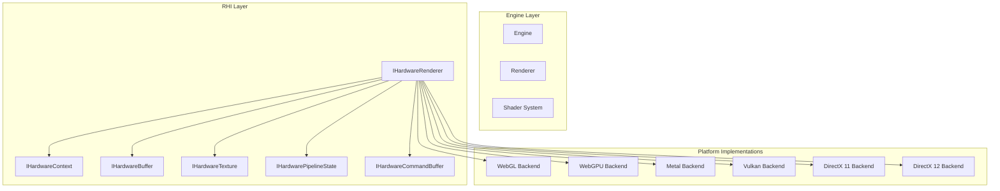
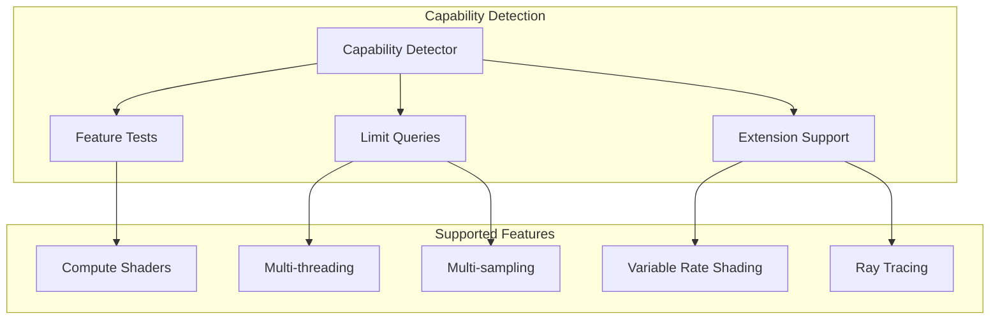
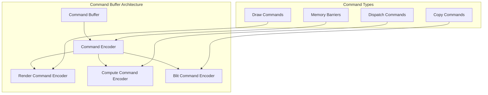
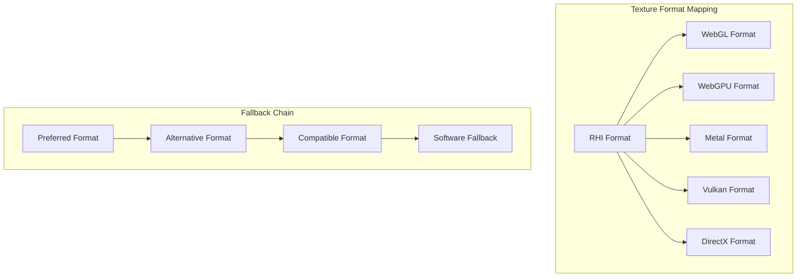
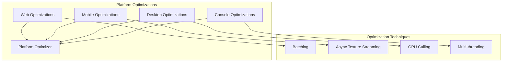
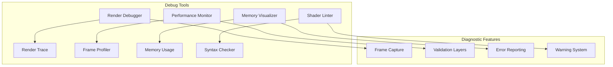

# 平台抽象层设计详解

## 概述

Galacean Engine 的平台抽象层（RHI - Rendering Hardware Interface）是一个统一的硬件抽象接口，通过标准化的API设计，屏蔽了不同平台和图形API的差异。系统支持WebGL、WebGPU、Metal、Vulkan、DirectX 11/12等多种后端，实现了真正的跨平台渲染能力。

## 架构设计理念

### 核心原则

1. **统一接口** - 所有平台使用相同的API
2. **零开销抽象** - 抽象层不带来性能损失
3. **特性检测** - 动态检测和适配平台能力
4. **渐进增强** - 基于平台能力提供不同功能级别

### 设计模式

- **适配器模式** - 不同图形API的适配
- **策略模式** - 平台特定的实现策略
- **工厂模式** - 平台对象的创建
- **桥接模式** - 抽象与实现的分离

## 核心组件架构

### 1. RHI架构概览



### 2. 核心接口定义

```typescript
// 渲染硬件接口主接口
interface IHardwareRenderer {
  // 设备信息
  readonly deviceName: string;
  readonly vendor: string;
  readonly apiVersion: string;
  readonly capabilities: IDeviceCapabilities;

  // 资源创建
  createBuffer(descriptor: BufferDescriptor): IHardwareBuffer;
  createTexture(descriptor: TextureDescriptor): IHardwareTexture;
  createPipelineState(descriptor: PipelineStateDescriptor): IHardwarePipelineState;
  createRenderPass(descriptor: RenderPassDescriptor): IHardwareRenderPass;
  createCommandBuffer(): IHardwareCommandBuffer;
  createSampler(descriptor: SamplerDescriptor): IHardwareSampler;

  // 上下文管理
  getMainContext(): IHardwareContext;
  createOffscreenContext(): IHardwareContext;

  // 同步和资源管理
  flush(): void;
  finish(): void;
  submit(commandBuffer: IHardwareCommandBuffer): void;
  waitIdle(): void;
}

// 渲染上下文接口
interface IHardwareContext {
  // 渲染状态设置
  setViewport(viewport: Viewport): void;
  setScissor(rect: Rectangle): void;
  setRenderTarget(renderTarget: IHardwareRenderTarget): void;
  setPipelineState(pipelineState: IHardwarePipelineState): void;

  // 资源绑定
  setVertexBuffer(buffer: IHardwareBuffer, slot: number): void;
  setIndexBuffer(buffer: IHardwareBuffer, format: IndexFormat): void;
  setTexture(texture: IHardwareTexture, slot: number): void;
  setSampler(sampler: IHardwareSampler, slot: number): void;

  // 绘制命令
  draw(vertexCount: number, startVertex: number): void;
  drawIndexed(indexCount: number, startIndex: number, baseVertex: number): void;
  drawInstanced(instanceCount: number, vertexCount: number, startVertex: number): void;
  drawIndexedInstanced(instanceCount: number, indexCount: number, startIndex: number, baseVertex: number): void;

  // 清理操作
  clear(flags: ClearFlags, color: Color, depth: number, stencil: number): void;
}
```

### 3. 设备能力检测



```typescript
interface IDeviceCapabilities {
  // 基础能力
  maxTextureSize: number;
  maxRenderTargets: number;
  maxVertexAttributes: number;
  maxVertexUniformVectors: number;
  maxFragmentUniformVectors: number;

  // 纹理支持
  supportedTextureFormats: TextureFormat[];
  maxTextureAnisotropy: number;
  maxArrayTextureLayers: number;

  // 渲染特性
  supportedBlendModes: BlendMode[];
  supportedCullModes: CullMode[];
  supportedFillModes: FillMode[];
  supportedCompareFunctions: CompareFunction[];

  // 高级特性
  supportsComputeShaders: boolean;
  supportsGeometryShaders: boolean;
  supportsTessellationShaders: boolean;
  supportsRayTracing: boolean;
  supportsVariableRateShading: boolean;

  // 多线程支持
  supportsMultiThreadedRendering: boolean;
  supportsAsyncCompute: boolean;

  // 内存管理
  supportsPersistentMapping: boolean;
  supportsSparseResources: boolean;
  supportsGpuMemoryManagement: boolean;
}

class CapabilityDetector {
  async detectCapabilities(renderer: IHardwareRenderer): Promise<IDeviceCapabilities> {
    const capabilities: IDeviceCapabilities = {
      maxTextureSize: this.queryMaxTextureSize(renderer),
      maxRenderTargets: this.queryMaxRenderTargets(renderer),
      maxVertexAttributes: this.queryMaxVertexAttributes(renderer),
      // ... 其他能力检测
      supportedTextureFormats: await this.detectTextureFormats(renderer),
      supportsComputeShaders: await this.testComputeShaderSupport(renderer),
      supportsRayTracing: await this.testRayTracingSupport(renderer),
      // ...
    };

    return capabilities;
  }

  private async testComputeShaderSupport(renderer: IHardwareRenderer): Promise<boolean> {
    try {
      // 尝试创建计算着色器管道
      const computeShader = `
        #version 450
        layout(local_size_x = 64) in;
        void main() {
          // 简单的计算着色器测试
        }
      `;

      const pipeline = renderer.createPipelineState({
        computeShader,
        type: PipelineType.Compute
      });

      return pipeline !== null;
    } catch (error) {
      return false;
    }
  }
}
```

## 平台实现详解

### 1. WebGL后端实现

```typescript
class WebGLRenderer implements IHardwareRenderer {
  private gl: WebGL2RenderingContext;
  private extensions: Map<string, any> = new Map();
  private capabilities: IDeviceCapabilities;

  constructor(canvas: HTMLCanvasElement) {
    this.gl = canvas.getContext('webgl2') as WebGL2RenderingContext;
    this.initializeExtensions();
    this.detectCapabilities();
  }

  createBuffer(descriptor: BufferDescriptor): IHardwareBuffer {
    return new WebGLBuffer(this.gl, descriptor);
  }

  createTexture(descriptor: TextureDescriptor): IHardwareTexture {
    return new WebGLTexture(this.gl, descriptor);
  }

  createPipelineState(descriptor: PipelineStateDescriptor): IHardwarePipelineState {
    return new WebGLPipelineState(this.gl, descriptor);
  }

  private initializeExtensions(): void {
    // 必需扩展
    const requiredExtensions = [
      'EXT_color_buffer_float',
      'OES_texture_float_linear',
      'WEBGL_depth_texture'
    ];

    for (const extName of requiredExtensions) {
      const ext = this.gl.getExtension(extName);
      if (ext) {
        this.extensions.set(extName, ext);
      } else {
        console.warn(`Required extension ${extName} not available`);
      }
    }

    // 可选扩展
    const optionalExtensions = [
      'WEBGL_draw_buffers',
      'WEBGL_multi_draw',
      'OES_vertex_array_object'
    ];

    for (const extName of optionalExtensions) {
      const ext = this.gl.getExtension(extName);
      if (ext) {
        this.extensions.set(extName, ext);
      }
    }
  }
}

class WebGLBuffer implements IHardwareBuffer {
  private gl: WebGL2RenderingContext;
  private buffer: WebGLBuffer;
  private size: number;
  private usage: BufferUsage;

  constructor(gl: WebGL2RenderingContext, descriptor: BufferDescriptor) {
    this.gl = gl;
    this.size = descriptor.size;
    this.usage = descriptor.usage;

    this.buffer = gl.createBuffer();
    this.bind();

    const glUsage = this.getGLUsage(descriptor.usage);
    gl.bufferData(this.getGLTarget(descriptor.type), descriptor.size || null, glUsage);

    if (descriptor.data) {
      this.setData(descriptor.data);
    }
  }

  setData(data: ArrayBufferView, offset?: number): void {
    this.bind();
    this.gl.bufferSubData(this.getGLTarget(), offset || 0, data);
  }

  private getGLTarget(type: BufferType): number {
    switch (type) {
      case BufferType.Vertex: return this.gl.ARRAY_BUFFER;
      case BufferType.Index: return this.gl.ELEMENT_ARRAY_BUFFER;
      case BufferType.Uniform: return this.gl.UNIFORM_BUFFER;
      default: throw new Error(`Unsupported buffer type: ${type}`);
    }
  }

  private getGLUsage(usage: BufferUsage): number {
    switch (usage) {
      case BufferUsage.Static: return this.gl.STATIC_DRAW;
      case BufferUsage.Dynamic: return this.gl.DYNAMIC_DRAW;
      case BufferUsage.Stream: return this.gl.STREAM_DRAW;
      default: return this.gl.STATIC_DRAW;
    }
  }
}
```

### 2. WebGPU后端实现

```typescript
class WebGPURenderer implements IHardwareRenderer {
  private adapter: GPUAdapter;
  private device: GPUDevice;
  private queue: GPUQueue;
  private capabilities: IDeviceCapabilities;

  constructor(canvas: HTMLCanvasElement) {
    this.initializeWebGPU(canvas);
  }

  private async initializeWebGPU(canvas: HTMLCanvasElement): Promise<void> {
    // 请求GPU适配器
    this.adapter = await navigator.gpu.requestAdapter({
      powerPreference: 'high-performance'
    });

    if (!this.adapter) {
      throw new Error('WebGPU adapter not available');
    }

    // 请求设备
    this.device = await this.adapter.requestDevice({
      requiredFeatures: this.getRequiredFeatures(),
      requiredLimits: this.getRequiredLimits()
    });

    this.queue = this.device.queue;
    this.detectCapabilities();
  }

  createBuffer(descriptor: BufferDescriptor): IHardwareBuffer {
    return new WebGPUBuffer(this.device, descriptor);
  }

  createTexture(descriptor: TextureDescriptor): IHardwareTexture {
    return new WebGPUTexture(this.device, descriptor);
  }

  createPipelineState(descriptor: PipelineStateDescriptor): IHardwarePipelineState {
    return new WebGPUPipelineState(this.device, descriptor);
  }

  private getRequiredFeatures(): GPUFeatureName[] {
    const features: GPUFeatureName[] = [];

    // 根据需求添加功能
    if (this.adapter.features.has('timestamp-query')) {
      features.push('timestamp-query');
    }
    if (this.adapter.features.has('pipeline-statistics-query')) {
      features.push('pipeline-statistics-query');
    }

    return features;
  }
}

class WebGPUCommandBuffer implements IHardwareCommandBuffer {
  private encoder: GPUCommandEncoder;
  private passEncoder: GPURenderPassEncoder | GPUComputePassEncoder | null = null;

  constructor(device: GPUDevice) {
    this.encoder = device.createCommandEncoder();
  }

  beginRenderPass(descriptor: RenderPassDescriptor): void {
    this.passEncoder = this.encoder.beginRenderPass({
      colorAttachments: descriptor.colorAttachments.map(att => ({
        view: att.attachment.gpuTexture.createView(),
        clearValue: att.clearColor ? [att.clearColor.r, att.clearColor.g, att.clearColor.b, att.clearColor.a] : undefined,
        loadOp: att.loadOp,
        storeOp: att.storeOp
      })),
      depthStencilAttachment: descriptor.depthAttachment ? {
        view: descriptor.depthAttachment.attachment.gpuTexture.createView(),
        depthClearValue: descriptor.depthAttachment.clearDepth,
        depthLoadOp: descriptor.depthAttachment.loadOp,
        depthStoreOp: descriptor.depthAttachment.storeOp,
        stencilClearValue: descriptor.depthAttachment.clearStencil,
        stencilLoadOp: descriptor.depthAttachment.stencilLoadOp,
        stencilStoreOp: descriptor.depthAttachment.stencilStoreOp
      } : undefined
    });
  }

  setPipelineState(pipelineState: IHardwarePipelineState): void {
    if (this.passEncoder instanceof GPURenderPassEncoder) {
      this.passEncoder.setPipeline((pipelineState as WebGPUPipelineState).gpuRenderPipeline);
    }
  }

  draw(vertexCount: number, startVertex: number = 0): void {
    if (this.passEncoder instanceof GPURenderPassEncoder) {
      this.passEncoder.draw(vertexCount, 1, startVertex, 0);
    }
  }

  end(): GPUCommandBuffer {
    if (this.passEncoder) {
      this.passEncoder.end();
      this.passEncoder = null;
    }
    return this.encoder.finish();
  }
}
```

### 3. Metal后端实现

```typescript
class MetalRenderer implements IHardwareRenderer {
  private device: MTLDevice;
  private commandQueue: MTLCommandQueue;
  private library: MTLLibrary;
  private capabilities: IDeviceCapabilities;

  constructor() {
    this.initializeMetal();
  }

  private initializeMetal(): void {
    this.device = MTLCreateSystemDefaultDevice();
    if (!this.device) {
      throw new Error('Metal device not available');
    }

    this.commandQueue = this.device.newCommandQueue();
    this.library = this.device.newDefaultLibrary();
    this.detectCapabilities();
  }

  createBuffer(descriptor: BufferDescriptor): IHardwareBuffer {
    return new MetalBuffer(this.device, descriptor);
  }

  createTexture(descriptor: TextureDescriptor): IHardwareTexture {
    return new MetalTexture(this.device, descriptor);
  }

  createPipelineState(descriptor: PipelineStateDescriptor): IHardwarePipelineState {
    return new MetalPipelineState(this.device, this.library, descriptor);
  }
}

class MetalBuffer implements IHardwareBuffer {
  private device: MTLDevice;
  private buffer: MTLBuffer;
  private size: number;
  private usage: BufferUsage;

  constructor(device: MTLDevice, descriptor: BufferDescriptor) {
    this.device = device;
    this.size = descriptor.size || 0;
    this.usage = descriptor.usage;

    const options = this.getMTLResourceOptions(descriptor.usage);
    this.buffer = device.newBufferWithLength(this.size, options);

    if (descriptor.data) {
      this.setData(descriptor.data);
    }
  }

  setData(data: ArrayBufferView, offset?: number): void {
    const contents = this.buffer.contents() as ArrayBuffer;
    const view = new Uint8Array(contents);
    view.set(new Uint8Array(data.buffer), offset || 0);
    this.buffer.didModifyRange(NSMakeRange(offset || 0, data.byteLength));
  }

  private getMTLResourceOptions(usage: BufferUsage): MTLResourceOptions {
    let options: MTLResourceOptions = MTLResourceStorageModeShared;

    if (usage === BufferUsage.Dynamic) {
      options |= MTLResourceCPUCacheModeWriteCombined;
    }

    return options;
  }
}
```

## 命令缓冲区抽象

### 1. 命令缓冲区设计



```typescript
abstract class BaseCommandBuffer implements IHardwareCommandBuffer {
  protected commands: ICommand[] = [];
  protected isRecording: boolean = false;
  protected currentPassType: PassType | null = null;

  begin(): void {
    this.isRecording = true;
    this.commands = [];
  }

  end(): void {
    this.isRecording = false;
  }

  // 绘制命令
  draw(vertexCount: number, startVertex: number = 0): void {
    this.ensureRenderPass();
    this.addCommand(new DrawCommand(vertexCount, startVertex));
  }

  drawIndexed(indexCount: number, startIndex: number = 0, baseVertex: number = 0): void {
    this.ensureRenderPass();
    this.addCommand(new DrawIndexedCommand(indexCount, startIndex, baseVertex));
  }

  drawInstanced(instanceCount: number, vertexCount: number, startVertex: number = 0): void {
    this.ensureRenderPass();
    this.addCommand(new DrawInstancedCommand(instanceCount, vertexCount, startVertex));
  }

  // 计算命令
  dispatch(x: number, y: number = 1, z: number = 1): void {
    this.ensureComputePass();
    this.addCommand(new DispatchCommand(x, y, z));
  }

  // 资源操作命令
  copyBuffer(srcBuffer: IHardwareBuffer, dstBuffer: IHardwareBuffer, size: number, srcOffset: number = 0, dstOffset: number = 0): void {
    this.addCommand(new CopyBufferCommand(srcBuffer, dstBuffer, size, srcOffset, dstOffset));
  }

  copyTexture(srcTexture: IHardwareTexture, dstTexture: IHardwareTexture, srcRegion: Region, dstRegion: Region): void {
    this.addCommand(new CopyTextureCommand(srcTexture, dstTexture, srcRegion, dstRegion));
  }

  // 内存屏障
  memoryBarrier(barrier: MemoryBarrier): void {
    this.addCommand(new MemoryBarrierCommand(barrier));
  }

  protected ensureRenderPass(): void {
    if (this.currentPassType !== PassType.Render) {
      throw new Error('Not in a render pass');
    }
  }

  protected ensureComputePass(): void {
    if (this.currentPassType !== PassType.Compute) {
      throw new Error('Not in a compute pass');
    }
  }

  protected addCommand(command: ICommand): void {
    if (!this.isRecording) {
      throw new Error('Command buffer is not recording');
    }
    this.commands.push(command);
  }

  abstract execute(): void;
}
```

### 2. 优化的命令缓冲区

```typescript
class OptimizedCommandBuffer extends BaseCommandBuffer {
  private commandGroups: Map<string, ICommandGroup> = new Map();

  override execute(): void {
    // 命令优化和重排序
    this.optimizeCommands();

    // 分组执行相同类型的命令
    for (const group of this.commandGroups.values()) {
      this.executeCommandGroup(group);
    }
  }

  private optimizeCommands(): void {
    // 合并连续的状态设置
    this.mergeStateCommands();

    // 排序绘制命令以减少状态切换
    this.sortDrawCommands();

    // 移除冗余命令
    this.removeRedundantCommands();

    // 批量处理资源操作
    this.batchResourceOperations();
  }

  private sortDrawCommands(): void {
    const drawCommands = this.commands.filter(cmd => cmd.type === CommandType.Draw) as DrawCommand[];

    // 按管道状态分组
    const groupedByPipeline = this.groupBy(drawCommands, cmd => cmd.pipelineState.id);

    // 在每个组内按材质排序
    for (const [pipelineId, commands] of groupedByPipeline) {
      commands.sort((a, b) => this.compareDrawCommands(a, b));
    }

    // 重新构建命令列表
    this.rebuildCommandList(groupedByPipeline);
  }

  private compareDrawCommands(a: DrawCommand, b: DrawCommand): number {
    // 比较材质
    if (a.material.id !== b.material.id) {
      return a.material.id - b.material.id;
    }

    // 比较网格
    if (a.mesh.id !== b.mesh.id) {
      return a.mesh.id - b.mesh.id;
    }

    // 比较距离（用于透明物体）
    return a.distance - b.distance;
  }
}
```

## 跨平台特性映射

### 1. 纹理格式映射



```typescript
class TextureFormatMapper {
  private mappings: Map<TextureFormat, PlatformFormatMapping>;

  constructor() {
    this.initializeMappings();
  }

  private initializeMappings(): void {
    this.mappings = new Map([
      [TextureFormat.RGBA8_UNorm, {
        webgl: 'RGBA',
        webgpu: 'rgba8unorm',
        metal: 'rgba8Unorm',
        vulkan: 'VK_FORMAT_R8G8B8A8_UNORM',
        dx11: 'DXGI_FORMAT_R8G8B8A8_UNORM'
      }],
      [TextureFormat.BC7_UNorm, {
        webgl: 'COMPRESSED_RGBA_S3TC_DXT5_EXT',
        webgpu: 'bc7-rgba-unorm',
        metal: 'bc7_rgba_unorm',
        vulkan: 'VK_FORMAT_BC7_UNORM_BLOCK',
        dx11: 'DXGI_FORMAT_BC7_UNORM'
      }],
      // ... 其他格式映射
    ]);
  }

  getNativeFormat(rhiFormat: TextureFormat, platform: Platform): string {
    const mapping = this.mappings.get(rhiFormat);
    if (!mapping) {
      throw new Error(`Unsupported texture format: ${rhiFormat}`);
    }

    const nativeFormat = mapping[platform];
    if (!nativeFormat) {
      // 尝试使用后备格式
      return this.getFallbackFormat(rhiFormat, platform);
    }

    return nativeFormat;
  }

  private getFallbackFormat(rhiFormat: TextureFormat, platform: Platform): string {
    // 定义格式后备链
    const fallbackChain = this.getFallbackChain(rhiFormat);

    for (const fallbackFormat of fallbackChain) {
      const mapping = this.mappings.get(fallbackFormat);
      if (mapping && mapping[platform]) {
        console.warn(`Using fallback format ${fallbackFormat} for ${rhiFormat}`);
        return mapping[platform];
      }
    }

    throw new Error(`No compatible format found for ${rhiFormat} on ${platform}`);
  }

  private getFallbackChain(rhiFormat: TextureFormat): TextureFormat[] {
    // 定义格式后备优先级
    switch (rhiFormat) {
      case TextureFormat.BC7_UNorm:
        return [TextureFormat.BC3_UNorm, TextureFormat.ETC2_RGBA8_UNorm, TextureFormat.RGBA8_UNorm];
      case TextureFormat.BC5_UNorm:
        return [TextureFormat.RG8_UNorm, TextureFormat.RGBA8_UNorm];
      default:
        return [TextureFormat.RGBA8_UNorm];
    }
  }
}
```

### 2. 着色器语言转换

```typescript
class ShaderLanguageConverter {
  private converters: Map<ShaderLanguage, IShaderConverter> = new Map();

  constructor() {
    this.initializeConverters();
  }

  private initializeConverters(): void {
    this.converters.set(ShaderLanguage.GLSL, new GLSLConverter());
    this.converters.set(ShaderLanguage.HLSL, new HLSLConverter());
    this.converters.set(ShaderLanguage.MSL, new MSLConverter());
    this.converters.set(ShaderLanguage.WGSL, new WGSLConverter());
  }

  convert(
    source: string,
    fromLanguage: ShaderLanguage,
    toLanguage: ShaderLanguage,
    targetPlatform: Platform
  ): string {
    if (fromLanguage === toLanguage) {
      return source;
    }

    const converter = this.converters.get(fromLanguage);
    if (!converter) {
      throw new Error(`No converter found for ${fromLanguage}`);
    }

    return converter.convert(source, toLanguage, targetPlatform);
  }
}

interface IShaderConverter {
  convert(source: string, targetLanguage: ShaderLanguage, targetPlatform: Platform): string;
}

class GLSLConverter implements IShaderConverter {
  convert(source: string, targetLanguage: ShaderLanguage, targetPlatform: Platform): string {
    switch (targetLanguage) {
      case ShaderLanguage.HLSL:
        return this.glslToHlsl(source);
      case ShaderLanguage.MSL:
        return this.glslToMsl(source);
      case ShaderLanguage.WGSL:
        return this.glslToWgsl(source);
      default:
        throw new Error(`Unsupported target language: ${targetLanguage}`);
    }
  }

  private glslToHlsl(source: string): string {
    // GLSL到HLSL的转换逻辑
    let converted = source;

    // 顶点属性位置
    converted = converted.replace(/layout\(location = (\d+)\)\s+in/g, (match, location) => {
      return `[${location}]`;
    });

    // 精度限定符
    converted = converted.replace(/\b(highp|mediump|lowp)\b/g, '');

    // 内置变量
    converted = converted.replace(/\bgl_Position\b/g, 'output.position');
    converted = converted.replace(/\bgl_FragColor\b/g, 'output.color');
    converted = converted.replace(/\bgl_FragCoord\b/g, 'input.position');

    // 矩阵类型
    converted = converted.replace(/\bmat([2-4])\b/g, 'float$1x$1');
    converted = converted.replace(/\bvec([2-4])\b/g, 'float$1');

    return converted;
  }
}
```

## 性能优化策略

### 1. 平台特定优化



```typescript
class PlatformOptimizer {
  private optimizationStrategies: Map<Platform, IOptimizationStrategy> = new Map();

  constructor() {
    this.initializeStrategies();
  }

  private initializeStrategies(): void {
    this.optimizationStrategies.set(Platform.Web, new WebOptimizationStrategy());
    this.optimizationStrategies.set(Platform.iOS, new MobileOptimizationStrategy());
    this.optimizationStrategies.set(Platform.Android, new MobileOptimizationStrategy());
    this.optimizationStrategies.set(Platform.Windows, new DesktopOptimizationStrategy());
    this.optimizationStrategies.set(Platform.MacOS, new DesktopOptimizationStrategy());
  }

  optimizeForPlatform(renderer: IHardwareRenderer, platform: Platform): void {
    const strategy = this.optimizationStrategies.get(platform);
    if (strategy) {
      strategy.apply(renderer);
    }
  }
}

class WebOptimizationStrategy implements IOptimizationStrategy {
  apply(renderer: IHardwareRenderer): void {
    // Web特定优化
    this.enableAsyncTextureLoading(renderer);
    this.optimizeBatching(renderer);
    this.enableProgressiveLoading(renderer);
  }

  private enableAsyncTextureLoading(renderer: IHardwareRenderer): void {
    // 启用异步纹理加载以避免阻塞主线程
    if (renderer.capabilities.supportsAsyncTextureLoading) {
      renderer.setAsyncLoadingEnabled(true);
    }
  }

  private optimizeBatching(renderer: IHardwareRenderer): void {
    // 优化批处理大小以减少Draw Call
    renderer.setBatchingStrategy(new WebGLBatchingStrategy());
  }
}

class MobileOptimizationStrategy implements IOptimizationStrategy {
  apply(renderer: IHardwareRenderer): void {
    // 移动设备特定优化
    this.reduceTextureQuality(renderer);
    this.enableDynamicResolution(renderer);
    this.optimizeForBattery(renderer);
  }

  private enableDynamicResolution(renderer: IHardwareRenderer): void {
    // 启用动态分辨率以保持帧率
    if (renderer.capabilities.supportsDynamicResolution) {
      const dynamicResolution = new DynamicResolutionManager(renderer);
      dynamicResolution.enable({
        minScale: 0.5,
        maxScale: 1.0,
        targetFrameTime: 16.67 // 60 FPS
      });
    }
  }
}
```

### 2. 自适应质量系统

```typescript
class AdaptiveQualitySystem {
  private frameTimeHistory: number[] = [];
  private memoryUsageHistory: number[] = [];
  private currentQualityLevel: QualityLevel = QualityLevel.High;

  update(): void {
    this.collectMetrics();
    this.adjustQuality();
  }

  private collectMetrics(): void {
    // 收集帧时间
    const frameTime = this.getLastFrameTime();
    this.frameTimeHistory.push(frameTime);
    if (this.frameTimeHistory.length > 60) {
      this.frameTimeHistory.shift();
    }

    // 收集内存使用
    const memoryUsage = this.getMemoryUsage();
    this.memoryUsageHistory.push(memoryUsage);
    if (this.memoryUsageHistory.length > 60) {
      this.memoryUsageHistory.shift();
    }
  }

  private adjustQuality(): void {
    const avgFrameTime = this.frameTimeHistory.reduce((a, b) => a + b, 0) / this.frameTimeHistory.length;
    const targetFrameTime = 16.67; // 60 FPS

    if (avgFrameTime > targetFrameTime * 1.2) {
      // 性能不足，降低质量
      this.downgradeQuality();
    } else if (avgFrameTime < targetFrameTime * 0.8) {
      // 性能充足，提升质量
      this.upgradeQuality();
    }

    // 检查内存压力
    const memoryPressure = this.calculateMemoryPressure();
    if (memoryPressure > 0.8) {
      this.applyMemoryOptimizations();
    }
  }

  private downgradeQuality(): void {
    switch (this.currentQualityLevel) {
      case QualityLevel.Ultra:
        this.applyQualitySettings(QualityLevel.High);
        break;
      case QualityLevel.High:
        this.applyQualitySettings(QualityLevel.Medium);
        break;
      case QualityLevel.Medium:
        this.applyQualitySettings(QualityLevel.Low);
        break;
      case QualityLevel.Low:
        // 已经是最低质量
        break;
    }
  }

  private applyQualitySettings(level: QualityLevel): void {
    const settings = QualityPresets[level];

    // 应用纹理质量
    this.setTextureQuality(settings.textureQuality);

    // 应用阴影质量
    this.setShadowQuality(settings.shadowQuality);

    // 应用抗锯齿设置
    this.setAntiAliasing(settings.antiAliasing);

    // 应用后处理效果
    this.setPostProcessingQuality(settings.postProcessingQuality);

    this.currentQualityLevel = level;
  }
}
```

## 调试和诊断工具

### 1. 渲染调试器



```typescript
class RenderDebugger {
  private captureEnabled: boolean = false;
  private currentFrame: FrameCapture | null = null;

  enableFrameCapture(): void {
    this.captureEnabled = true;
    this.currentFrame = new FrameCapture();
  }

  captureDrawCall(command: DrawCommand): void {
    if (!this.captureEnabled || !this.currentFrame) {
      return;
    }

    const drawCallInfo = new DrawCallInfo({
      command,
      pipelineState: command.pipelineState,
      vertexBuffer: command.vertexBuffer,
      indexBuffer: command.indexBuffer,
      textures: command.textures,
      uniforms: command.uniforms,
      renderTarget: command.renderTarget
    });

    this.currentFrame.addDrawCall(drawCallInfo);
  }

  async analyzeFrame(): Promise<FrameAnalysis> {
    if (!this.currentFrame) {
      throw new Error('No frame captured');
    }

    const analysis = new FrameAnalysis();

    // 分析性能瓶颈
    const bottlenecks = await this.identifyBottlenecks();
    analysis.addBottlenecks(bottlenecks);

    // 分析资源使用
    const resourceUsage = this.analyzeResourceUsage();
    analysis.setResourceUsage(resourceUsage);

    // 检测潜在问题
    const issues = this.detectIssues();
    analysis.addIssues(issues);

    return analysis;
  }

  private async identifyBottlenecks(): Promise<Bottleneck[]> {
    const bottlenecks: Bottleneck[] = [];

    // 分析Draw Call数量
    if (this.currentFrame.drawCallCount > 1000) {
      bottlenecks.push(new Bottleneck(
        BottleneckType.TooManyDrawCalls,
        `High draw call count: ${this.currentFrame.drawCallCount}`
      ));
    }

    // 分析状态切换
    if (this.currentFrame.stateSwitchCount > 100) {
      bottlenecks.push(new Bottleneck(
        BottleneckType.ExcessiveStateChanges,
        `Excessive state changes: ${this.currentFrame.stateSwitchCount}`
      ));
    }

    // 分析内存带宽
    const memoryBandwidth = this.calculateMemoryBandwidth();
    if (memoryBandwidth > this.getOptimalBandwidth()) {
      bottlenecks.push(new Bottleneck(
        BottleneckType.MemoryBandwidth,
        `High memory bandwidth usage: ${memoryBandwidth}MB/s`
      ));
    }

    return bottlenecks;
  }
}
```

## 扩展点设计

### 1. 自定义平台支持

```typescript
abstract class CustomPlatformRenderer implements IHardwareRenderer {
  abstract createBuffer(descriptor: BufferDescriptor): IHardwareBuffer;
  abstract createTexture(descriptor: TextureDescriptor): IHardwareTexture;
  abstract createPipelineState(descriptor: PipelineStateDescriptor): IHardwarePipelineState;

  // 平台特定功能
  abstract initializePlatform(): void;
  abstract shutdownPlatform(): void;
  abstract handlePlatformEvents(): void;
}

// 注册自定义平台
class PlatformRegistry {
  private static platforms: Map<string, PlatformConstructor> = new Map();

  static registerPlatform(name: string, constructor: PlatformConstructor): void {
    this.platforms.set(name, constructor);
  }

  static createPlatform(name: string): IHardwareRenderer | null {
    const constructor = this.platforms.get(name);
    return constructor ? new constructor() : null;
  }
}

// 使用示例
PlatformRegistry.registerPlatform('custom-platform', CustomPlatformRenderer);
```

### 2. 自命令扩展

```typescript
interface ICustomCommand extends ICommand {
  execute(renderer: IHardwareRenderer): void;
}

class CustomCommandExtension {
  private commandHandlers: Map<CommandType, ICommandHandler> = new Map();

  registerCommandHandler(type: CommandType, handler: ICommandHandler): void {
    this.commandHandlers.set(type, handler);
  }

  handleCommand(command: ICustomCommand, renderer: IHardwareRenderer): void {
    const handler = this.commandHandlers.get(command.type);
    if (handler) {
      handler.execute(command, renderer);
    } else {
      throw new Error(`No handler for command type: ${command.type}`);
    }
  }
}
```

## 设计决策和权衡

### 1. 抽象层级 vs 性能

**决策：** 最小化抽象开销
**权衡：** 接口复杂度增加，性能接近原生
**优化：** 编译时特化和内联优化

### 2. 功能完整性 vs 平台覆盖率

**决策：** 核心功能优先，可选功能渐进增强
**权衡：** 部分平台功能受限，整体兼容性好
**优化：** 功能检测和优雅降级

### 3. 开发效率 vs 运行时效率

**决策：** 编译时优化为主，运行时优化为辅
**权衡：** 开发复杂度增加，运行时性能优秀
**优化：** 代码生成和模板特化

## 最佳实践

### 1. 平台适配

- **特性检测优先** - 基于能力而非平台判断
- **渐进增强** - 提供基础功能，逐步增强
- **优雅降级** - 功能不可用时的备选方案

### 2. 性能优化

- **平台特化** - 利用平台独特优势
- **批量处理** - 减少API调用开销
- **异步操作** - 避免阻塞主线程

### 3. 调试支持

- **详细日志** - 提供完整的调试信息
- **性能分析** - 内置性能监控
- **错误恢复** - 优雅的错误处理

## 未来发展方向

### 1. 更多的API支持

- DirectX 12 Ultimate
- Vulkan的更深层集成
- Metal的新特性支持

### 2. 机器学习集成

- AI驱动的性能优化
- 智能资源管理
- 自适应质量调节

### 3. 云端渲染支持

- 流式渲染集成
- 分布式渲染
- 云端资源管理

## 总结

Galacean Engine的平台抽象层通过精心设计的接口和优化策略，实现了真正的跨平台渲染能力。系统在保持高性能的同时，提供了统一的开发体验，使开发者能够专注于内容创作而非平台适配细节。持续的优化和扩展确保了系统能够适应不断变化的图形技术生态。

## ⚠️ 禁止事项

### 关键约束 (🚫)
- 🚫 **禁止**在应用层直接使用平台特定的图形API调用
- 🚫 **禁止**假设特定平台的GPU能力（必须通过特性检测）
- 🚫 **禁止**在渲染上下文切换时忽略状态缓存
- 🚫 **禁止**在命令缓冲区执行期间修改已提交的命令

### 常见错误 (❌)
- ❌ **错误**: 未检查OpenGL ES扩展就使用高级功能
- ❌ **错误**: 在WebGPU中同步等待GPU操作完成
- ❌ **错误**: 忽略不同平台的纹理格式支持差异
- ❌ **错误**: 在统一接口中使用平台特定的优化技巧

### 最佳实践 (✅)
- ✅ **推荐**: 始终通过能力检测API判断功能支持
- ✅ **推荐**: 使用优雅降级策略处理不支持的功能
- ✅ **推荐**: 批量提交渲染命令减少API调用开销
- ✅ **推荐**: 利用命令缓冲区的优化特性（如WebGPU的预编译管线）
- ✅ **推荐**: 针对不同平台使用合适的纹理压缩格式