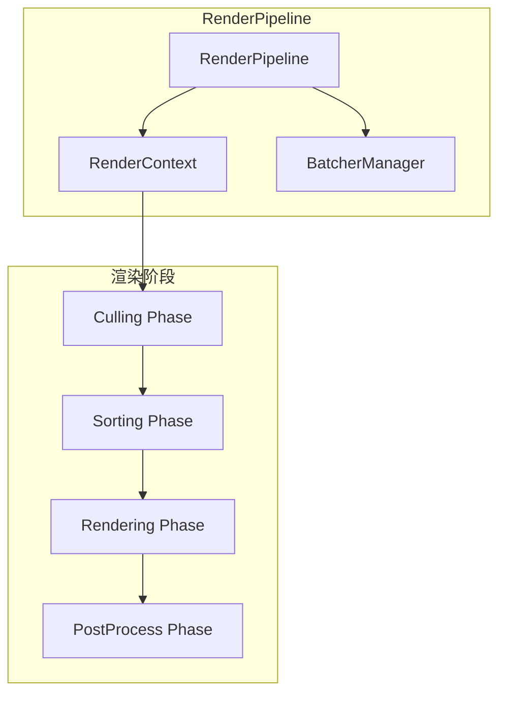
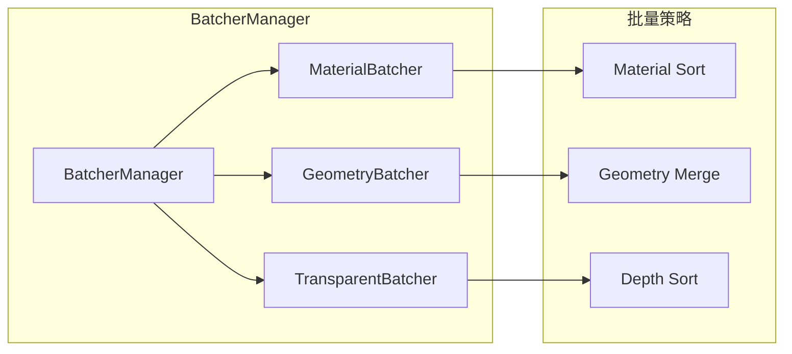
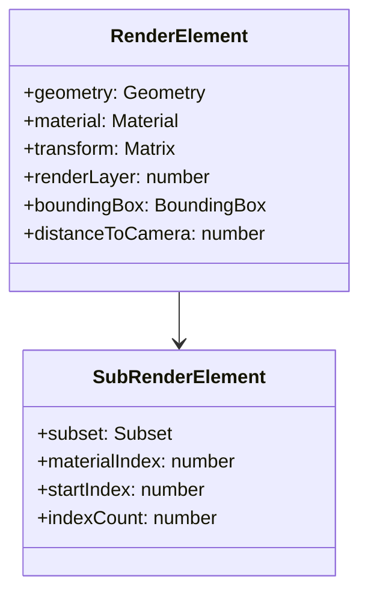
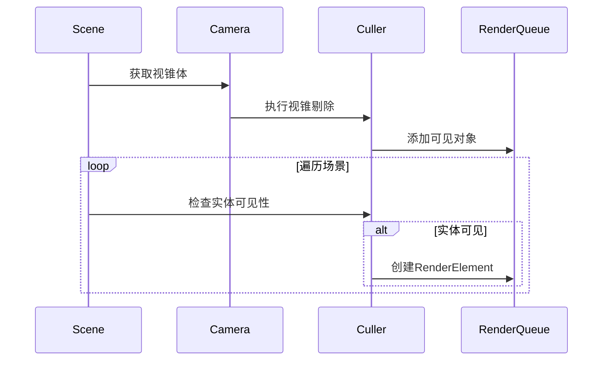
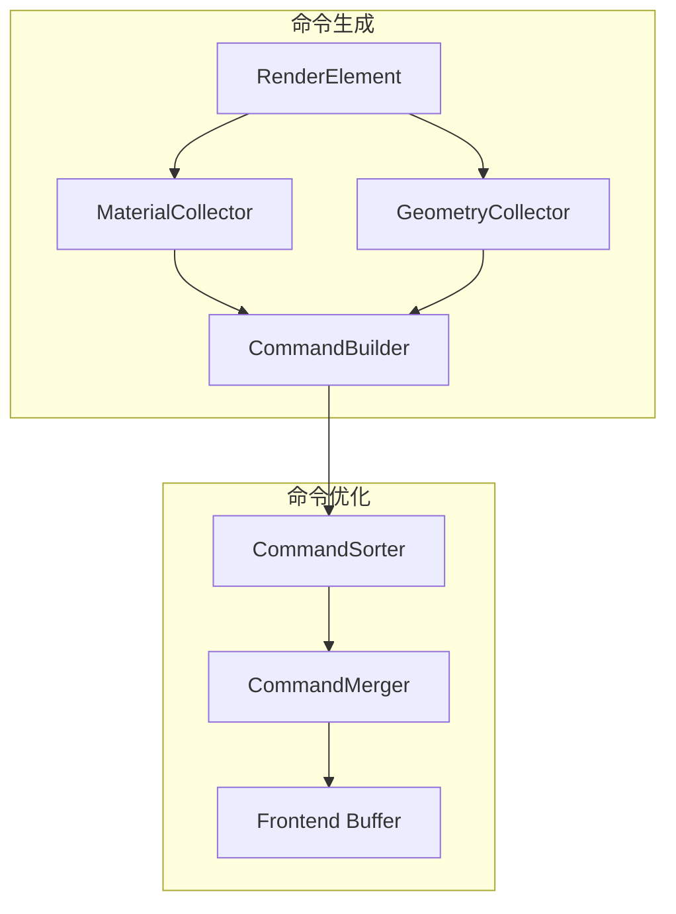
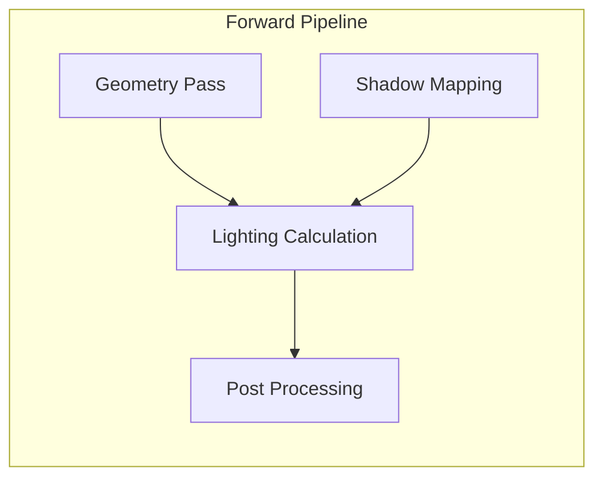
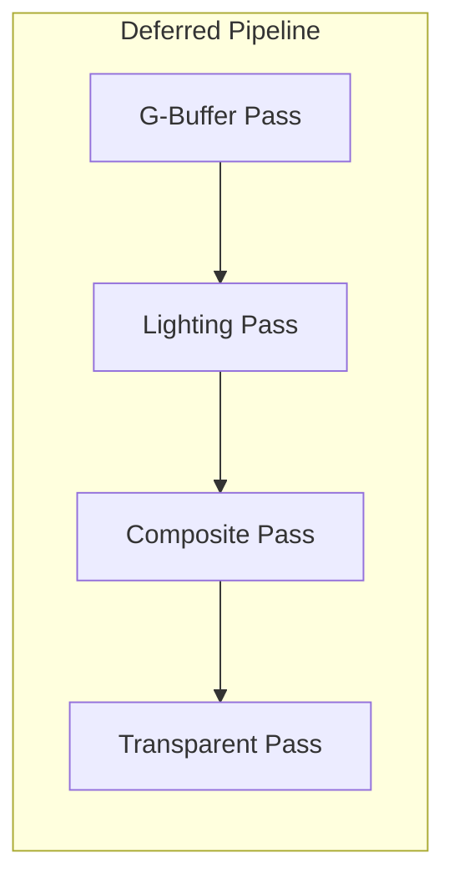
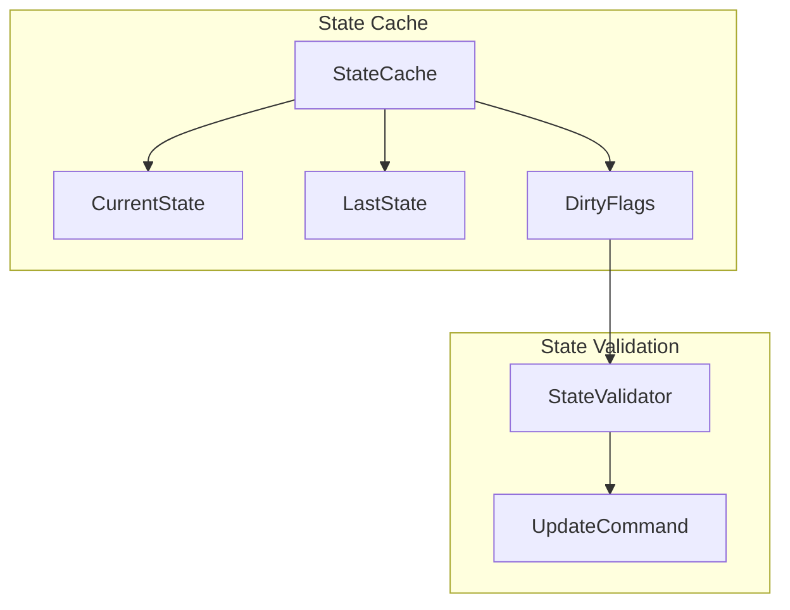

# 渲染管线架构详解

## 概述

Galacean Engine 的渲染管线是一个高度模块化的多通道渲染系统，采用可编程的渲染策略，支持前向渲染、延迟渲染和自定义渲染流程。管线设计遵循数据驱动和缓存友好的原则，通过批量处理和状态排序优化渲染性能。

## 架构设计理念

### 核心原则

1. **可编程性** - 支持灵活的渲染流程定义
2. **高性能** - 最小化状态切换，最大化批量处理
3. **可扩展性** - 易于添加新的渲染通道和效果
4. **平台无关** - 通过RHI抽象底层图形API

### 设计模式

- **策略模式** - 渲染策略可配置
- **命令模式** - 渲染命令缓存和排序
- **访问者模式** - 渲染元素统一处理
- **对象池模式** - 内存管理和GC优化

## 核心组件架构

### 1. 渲染管线主控制器 (RenderPipeline)



**职责：**
- 协调渲染流程的各个阶段
- 管理渲染上下文和状态
- 控制渲染命令的生成和执行
- 处理多通道渲染策略

### 2. 渲染上下文 (RenderContext)

```typescript
class RenderContext {
  // 渲染状态管理
  camera: Camera;
  viewport: Viewport;
  renderTarget: RenderTarget;

  // 管线状态
  renderPass: RenderPass;
  renderQueue: RenderQueue[];

  // 缓存管理
  commandBuffer: CommandBuffer;
  stateCache: StateCache;
}
```

**核心功能：**
- 维护当前渲染帧的完整上下文
- 管理视口、摄像机和渲染目标
- 缓存渲染状态以减少重复设置
- 提供渲染命令的记录和执行接口

### 3. 批量管理器 (BatcherManager)



**批量策略：**

1. **材质批量** - 相同材质的渲染对象合并
2. **几何批量** - 相同网格的对象实例化渲染
3. **透明批量** - 深度排序的透明对象渲染

### 4. 渲染元素 (RenderElement)



## 渲染流程详解

### 1. 场景遍历和收集阶段



**关键算法：**
- 视锥剔除 (Frustum Culling)
- 遮挡剔除 (Occlusion Culling)
- 距离剔除 (Distance Culling)
- 层级剔除 (Layer Culling)

### 2. 渲染队列排序阶段

```typescript
enum RenderQueueType {
  Opaque = 0,          // 不透明队列
  AlphaTest = 1000,    // Alpha测试队列
  Transparent = 2000,  // 透明队列
  Overlay = 3000       // 覆盖队列
}
```

**排序策略：**
1. **不透明队列** - 材质优先，减少状态切换
2. **透明队列** - 深度优先，保证正确的混合
3. **自定义队列** - 用户定义的排序规则

### 3. 渲染命令生成阶段



### 4. 渲染执行阶段

```typescript
interface IHardwareRenderer {
  // 渲染状态设置
  setRenderState(state: RenderState): void;
  setViewport(viewport: Viewport): void;
  setRenderTarget(target: RenderTarget): void;

  // 绘制命令
  drawArrays(primitive: Primitive, first: number, count: number): void;
  drawElements(primitive: Primitive, count: number, offset: number): void;
  drawIndexedInstanced(primitive: Primitive, count: number, instanceCount: number): void;
}
```

## 多通道渲染支持

### 前向渲染 (Forward Rendering)



**特点：**
- 单通道几何渲染
- 像素级光照计算
- 适合低复杂度场景
- 内存占用较小

### 延迟渲染 (Deferred Rendering)



**G-Buffer结构：**
- Albedo + Roughness (RGBA8)
- Normal + Metallic (RGB10A2)
- Motion Vector + Depth (RG16F + Depth24)
- Emission + Occlusion (RGBA8)

### 自定义渲染通道

```typescript
class CustomRenderPass extends RenderPass {
  constructor() {
    super();
    this.name = "CustomPass";
    this.renderQueue = RenderQueueType.Opaque;
  }

  render(context: RenderContext): void {
    // 自定义渲染逻辑
  }
}
```

## 性能优化策略

### 1. 状态缓存机制



### 2. 批量渲染优化

- **实例化渲染** - 相同几何体的大量对象
- **几何合并** - 静态网格的预合并
- **材质变体** - 着色器变体的预编译

### 3. GPU驱动的渲染

```typescript
// GPU Driven Rendering Pipeline
class GPURenderPipeline {
  // Indirect Drawing
  drawElementsIndirect(
    commandBuffer: GPUBuffer,
    offset: number
  ): void;

  // Compute Culling
  computeCulling(
    commandsBuffer: GPUBuffer,
    culledBuffer: GPUBuffer
  ): void;
}
```

## 扩展点设计

### 1. 自定义渲染通道

```typescript
interface IRenderPassExtension {
  name: string;
  order: number;
  render(context: RenderContext): void;
  canRender(context: RenderContext): boolean;
}
```

### 2. 自定义批量策略

```typescript
interface IBatchingStrategy {
  canBatch(element1: RenderElement, element2: RenderElement): boolean;
  batch(elements: RenderElement[]): BatchedRenderElement;
  getBatchKey(element: RenderElement): string;
}
```

### 3. 自定义排序算法

```typescript
interface ISortingAlgorithm {
  sort(elements: RenderElement[], camera: Camera): void;
  compare(element1: RenderElement, element2: RenderElement): number;
}
```

## 设计决策和权衡

### 1. 灵活性 vs 性能

**决策：** 采用可配置的渲染管线策略
**权衡：** 增加了复杂度，但提供了更大的灵活性
**优化：** 预编译和缓存机制减少运行时开销

### 2. 内存使用 vs 渲染效率

**决策：** 使用对象池和缓存系统
**权衡：** 增加了内存占用，但减少了GC压力
**优化：** 动态池大小调整和LRU缓存策略

### 3. 平台抽象 vs 原生性能

**决策：** 通过RHI抽象图形API
**权衡：** 抽象层可能引入性能开销
**优化：** 零开销抽象和平台特化路径

## 未来扩展方向

### 1. WebGPU集成

- 计算着色器支持
- 更细粒度的GPU控制
- 更好的并行处理能力

### 2. 实时光线追踪

- 光线追踪渲染通道
- 混合光栅化-光线追踪管线
- 硬件加速的光线追踪支持

### 3. AI驱动的渲染优化

- 智能LOD选择
- 预测性资源加载
- 自适应质量调整

## 总结

Galacean Engine 的渲染管线架构在保持高性能的同时，提供了足够的灵活性和可扩展性。通过模块化设计、缓存优化和批量处理，管线能够高效地处理复杂的渲染场景。未来的发展将聚焦于新一代图形API的支持和智能化渲染优化。