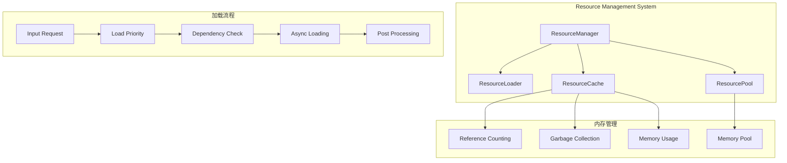
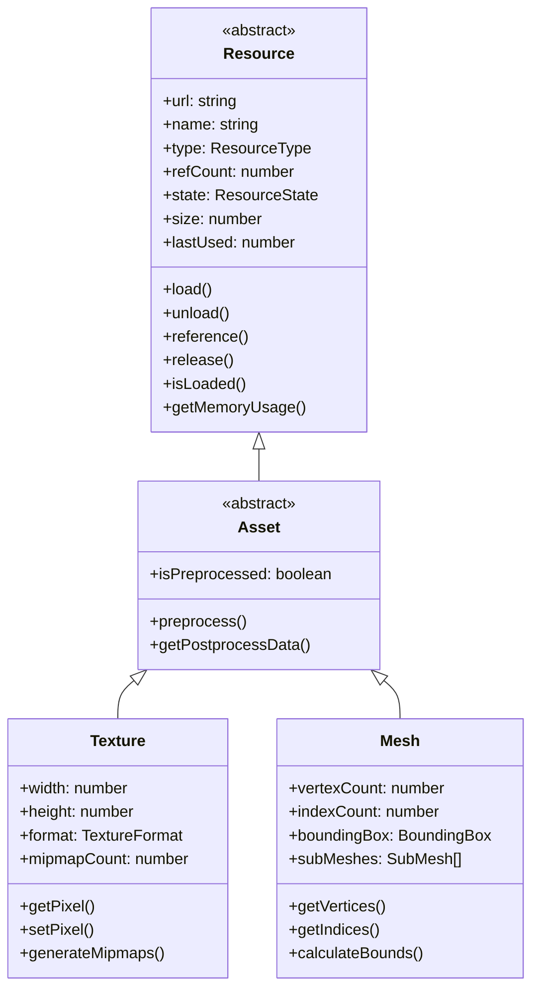
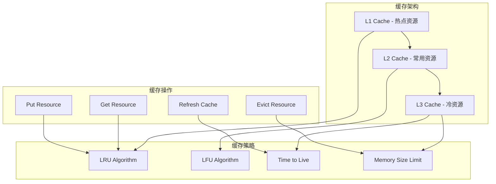
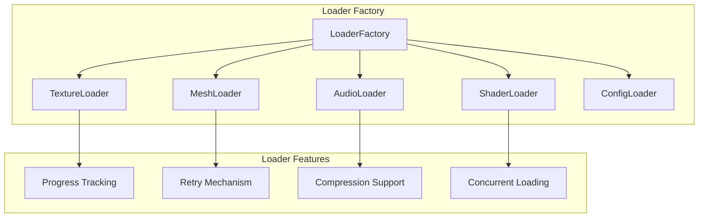
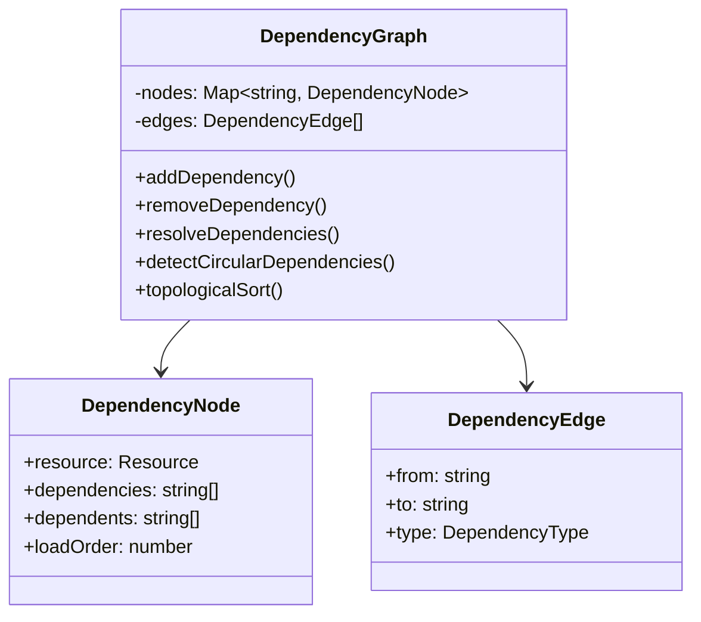
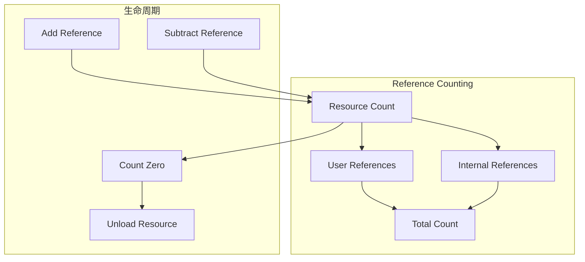
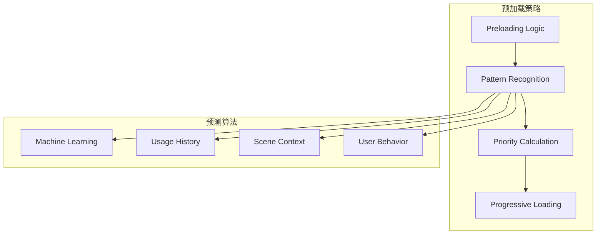
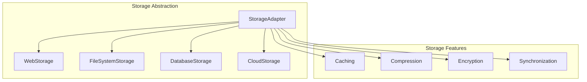
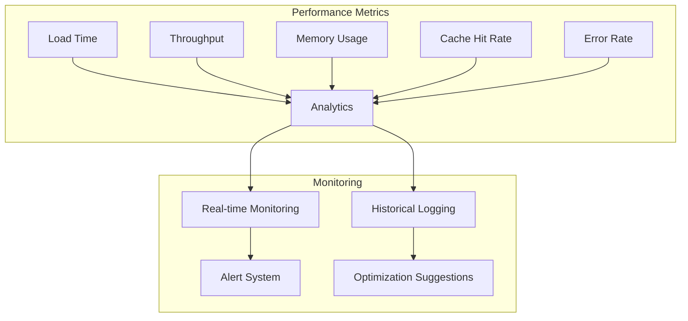

# 资源管理系统架构详解

## 概述

Galacean Engine 的资源管理系统是一个高度优化的异步加载和缓存框架，采用引用计数、智能预加载和内存池等技术，实现了高效的资源生命周期管理。系统支持多种资源类型、流式加载和渐进式卸载，确保在不同平台上都能提供流畅的用户体验。

## 架构设计理念

### 核心原则

1. **异步优先** - 所有资源操作都是非阻塞的
2. **内存友好** - 智能缓存和自动垃圾回收
3. **平台适配** - 支持Web、移动端和桌面端
4. **可扩展性** - 易于添加新的资源类型和加载器

### 设计模式

- **工厂模式** - 资源创建和管理
- **观察者模式** - 资源状态变更通知
- **策略模式** - 不同平台的加载策略
- **单例模式** - 全局资源管理器

## 核心组件架构

### 1. 资源管理系统概览



### 2. 资源管理器核心

```typescript
class ResourceManager {
  private cache: ResourceCache;
  private loaderFactory: LoaderFactory;
  private dependencyGraph: DependencyGraph;
  private memoryManager: MemoryManager;
  private eventDispatcher: EventDispatcher;

  // 资源加载
  async loadResource<T extends Resource>(
    url: string,
    type: ResourceType,
    options?: LoadOptions
  ): Promise<T> {
    // 1. 检查缓存
    const cached = this.cache.get(url);
    if (cached) {
      this.cache.reference(url);
      return cached as T;
    }

    // 2. 解析依赖
    const dependencies = await this.resolveDependencies(url, type);

    // 3. 加载依赖
    const loadedDependencies = await this.loadDependencies(dependencies);

    // 4. 创建加载器
    const loader = this.loaderFactory.createLoader(type);

    // 5. 异步加载
    const resource = await loader.load(url, options, loadedDependencies);

    // 6. 缓存资源
    this.cache.add(url, resource);

    return resource as T;
  }

  // 预加载资源
  async preloadResources(requests: ResourceRequest[]): Promise<void> {
    // 按优先级排序
    const sortedRequests = this.sortByPriority(requests);

    // 分组加载（避免同时加载过多资源）
    const chunks = this.chunkArray(sortedRequests, this.maxConcurrentLoads);

    for (const chunk of chunks) {
      await Promise.all(
        chunk.map(request => this.loadResource(request.url, request.type, request.options))
      );
    }
  }
}
```

### 3. 资源基类设计



### 4. 资源缓存系统



```typescript
class ResourceCache {
  private l1Cache: Map<string, Resource>;  // 热点缓存
  private l2Cache: Map<string, Resource>;  // 常用缓存
  private l3Cache: Map<string, Resource>;  // 冷资源缓存

  private l1Size: number = 100;   // 热点资源数量
  private l2Size: number = 500;   // 常用资源数量
  private maxMemory: number = 512 * 1024 * 1024;  // 最大内存限制

  get(url: string): Resource | null {
    // L1缓存查找
    const resource = this.l1Cache.get(url);
    if (resource) {
      this.updateAccessTime(resource);
      return resource;
    }

    // L2缓存查找
    const l2Resource = this.l2Cache.get(url);
    if (l2Resource) {
      // 提升到L1缓存
      this.promoteToL1(l2Resource);
      return l2Resource;
    }

    // L3缓存查找
    const l3Resource = this.l3Cache.get(url);
    if (l3Resource) {
      // 提升到L2缓存
      this.promoteToL2(l3Resource);
      return l3Resource;
    }

    return null;
  }

  add(url: string, resource: Resource): void {
    const totalMemory = this.getCurrentMemoryUsage();
    const resourceSize = resource.getMemoryUsage();

    // 检查内存限制
    if (totalMemory + resourceSize > this.maxMemory) {
      this.evictLeastUsed(resourceSize);
    }

    // 添加到L1缓存
    this.l1Cache.set(url, resource);

    // 如果L1缓存已满，将最少使用的移到L2
    if (this.l1Cache.size > this.l1Size) {
      this.demoteToL2();
    }
  }

  private evictLeastUsed(requiredMemory: number): void {
    // 从L3开始释放资源
    while (this.getCurrentMemoryUsage() + requiredMemory > this.maxMemory) {
      const lruResource = this.findLRUResource();
      if (lruResource) {
        this.releaseResource(lruResource);
      } else {
        break;
      }
    }
  }
}
```

## 异步加载系统

### 1. 加载器工厂



```typescript
interface IResourceLoader {
  canLoad(url: string): boolean;
  load(url: string, options?: LoadOptions, dependencies?: Resource[]): Promise<Resource>;
  getProgress(): number;
  cancel(): void;
}

class TextureLoader implements IResourceLoader {
  private imageLoaders: Map<string, ImageLoader>;
  private compressionFormats: Set<string>;

  async load(url: string, options?: LoadOptions): Promise<Texture> {
    // 1. 检测压缩格式
    const format = this.detectFormat(url);

    // 2. 选择合适的加载器
    const loader = this.getLoaderForFormat(format);

    // 3. 加载图像数据
    const imageData = await loader.load(url, options);

    // 4. 创建纹理
    const texture = new Texture(imageData.width, imageData.height, format);

    // 5. 上传数据到GPU
    await texture.uploadData(imageData);

    // 6. 生成Mipmap（如果需要）
    if (options?.generateMipmaps) {
      texture.generateMipmaps();
    }

    return texture;
  }

  private detectFormat(url: string): TextureFormat {
    const extension = this.getExtension(url);
    return this.extensionToFormat(extension);
  }

  private async loadWithRetry(url: string, maxRetries: number = 3): Promise<ImageData> {
    let lastError: Error;

    for (let attempt = 0; attempt <= maxRetries; attempt++) {
      try {
        return await this.loadImageData(url);
      } catch (error) {
        lastError = error;
        if (attempt < maxRetries) {
          await this.delay(Math.pow(2, attempt) * 1000);  // 指数退避
        }
      }
    }

    throw lastError;
  }
}
```

### 2. 依赖管理



```typescript
class DependencyManager {
  private graph: DependencyGraph;
  private loadingQueue: LoadingQueue;

  async resolveDependencies(url: string, type: ResourceType): Promise<Dependency[]> {
    const dependencies = await this.extractDependencies(url, type);

    // 检测循环依赖
    if (this.hasCircularDependency(url, dependencies)) {
      throw new Error(`Circular dependency detected for ${url}`);
    }

    // 拓扑排序确定加载顺序
    const sortedDependencies = this.topologicalSort(dependencies);

    return sortedDependencies;
  }

  private async extractDependencies(url: string, type: ResourceType): Promise<Dependency[]> {
    const dependencies: Dependency[] = [];

    switch (type) {
      case ResourceType.Scene:
        dependencies.push(...await this.extractSceneDependencies(url));
        break;
      case ResourceType.Material:
        dependencies.push(...await this.extractMaterialDependencies(url));
        break;
      case ResourceType.Shader:
        dependencies.push(...await this.extractShaderDependencies(url));
        break;
    }

    return dependencies;
  }

  private async extractSceneDependencies(url: string): Promise<Dependency[]> {
    const sceneData = await this.loadSceneMetadata(url);
    const dependencies: Dependency[] = [];

    // 提取模型依赖
    for (const modelPath of sceneData.models) {
      dependencies.push({
        url: modelPath,
        type: ResourceType.Mesh,
        required: true
      });
    }

    // 提取材质依赖
    for (const materialPath of sceneData.materials) {
      dependencies.push({
        url: materialPath,
        type: ResourceType.Material,
        required: true
      });
    }

    // 提取纹理依赖
    for (const texturePath of sceneData.textures) {
      dependencies.push({
        url: texturePath,
        type: ResourceType.Texture,
        required: false  // 可选依赖
      });
    }

    return dependencies;
  }
}
```

## 内存管理优化

### 1. 引用计数系统



```typescript
class ReferenceCounted {
  private _refCount: number = 0;
  private _strongRefs: Set<string> = new Set();
  private _weakRefs: Set<string> = new Set();

  addReference(holder: string, strong: boolean = true): void {
    if (strong) {
      this._strongRefs.add(holder);
      this._refCount++;
    } else {
      this._weakRefs.add(holder);
    }
  }

  releaseReference(holder: string): void {
    if (this._strongRefs.has(holder)) {
      this._strongRefs.delete(holder);
      this._refCount--;
    } else {
      this._weakRefs.delete(holder);
    }

    // 检查是否需要卸载
    if (this._refCount === 0) {
      this.onZeroReferences();
    }
  }

  get referenceCount(): number {
    return this._refCount;
  }

  protected abstract onZeroReferences(): void;
}

class Resource extends ReferenceCounted {
  private state: ResourceState = ResourceState.Unloaded;

  protected onZeroReferences(): void {
    // 延迟卸载，给其他组件时间重新引用
    setTimeout(() => {
      if (this._refCount === 0) {
        this.unload();
      }
    }, 1000);
  }

  unload(): void {
    if (this.state === ResourceState.Loaded) {
      this.releaseMemory();
      this.state = ResourceState.Unloaded;
    }
  }
}
```

### 2. 内存池管理

```typescript
class ResourceMemoryPool {
  private pools: Map<ResourceType, ObjectPool>;
  private allocationStats: Map<ResourceType, AllocationStats>;

  constructor() {
    this.initializePools();
  }

  private initializePools(): void {
    this.pools.set(ResourceType.Texture, new ObjectPool<Texture>(Texture, 100));
    this.pools.set(ResourceType.Mesh, new ObjectPool<Mesh>(Mesh, 50));
    this.pools.set(ResourceType.Material, new ObjectPool<Material>(Material, 200));
    this.pools.set(ResourceType.Audio, new ObjectPool<AudioClip>(AudioClip, 30));
  }

  acquire<T extends Resource>(type: ResourceType): T {
    const pool = this.pools.get(type);
    if (pool) {
      const resource = pool.acquire() as T;
      this.updateAllocationStats(type, true);
      return resource;
    }
    throw new Error(`No pool for resource type: ${type}`);
  }

  release(resource: Resource): void {
    const pool = this.pools.get(resource.type);
    if (pool) {
      resource.reset();  // 重置资源状态
      pool.release(resource);
      this.updateAllocationStats(resource.type, false);
    }
  }

  // 预分配资源
  preallocate(type: ResourceType, count: number): void {
    const pool = this.pools.get(type);
    if (pool) {
      pool.preallocate(count);
    }
  }

  // 内存使用统计
  getMemoryUsage(): MemoryUsageReport {
    const report = new MemoryUsageReport();

    for (const [type, stats] of this.allocationStats) {
      report.addTypeUsage(type, stats);
    }

    return report;
  }
}
```

### 3. 智能预加载



```typescript
class SmartPreloader {
  private usageAnalyzer: ResourceUsageAnalyzer;
  private patternMatcher: UsagePatternMatcher;
  private preloadQueue: PriorityQueue<ResourceRequest>;

  constructor() {
    this.usageAnalyzer = new ResourceUsageAnalyzer();
    this.patternMatcher = new UsagePatternMatcher();
    this.preloadQueue = new PriorityQueue();
  }

  // 分析使用模式并预测需要的资源
  async analyzeAndPredict(currentScene: Scene): Promise<ResourceRequest[]> {
    // 1. 分析历史使用模式
    const historicalPatterns = await this.usageAnalyzer.analyzeHistoricalData();

    // 2. 分析当前场景上下文
    const contextualResources = this.analyzeSceneContext(currentScene);

    // 3. 匹配使用模式
    const predictedResources = await this.patternMatcher.matchPatterns(
      historicalPatterns,
      contextualResources
    );

    // 4. 计算优先级
    const prioritizedRequests = this.calculatePriorities(predictedResources);

    return prioritizedRequests;
  }

  private analyzeSceneContext(scene: Scene): ResourceContext {
    const context = new ResourceContext();

    // 分析场景中的对象
    for (const entity of scene.entities) {
      const components = entity.getComponents();

      for (const component of components) {
        if (component instanceof ModelRenderer) {
          context.addMesh(component.mesh);
          context.addMaterial(component.material);
        }
      }
    }

    // 分析可能的转换
    const transitions = this.predictSceneTransitions(scene);
    for (const transition of transitions) {
      context.addPotentialResources(transition.resources);
    }

    return context;
  }

  private calculatePriorities(resources: Resource[]): ResourceRequest[] {
    return resources.map(resource => ({
      resource,
      priority: this.calculateResourcePriority(resource),
      estimatedLoadTime: this.estimateLoadTime(resource)
    })).sort((a, b) => b.priority - a.priority);
  }

  // 开始预加载
  async startPreloading(requests: ResourceRequest[]): Promise<void> {
    for (const request of requests) {
      this.preloadQueue.enqueue(request);
    }

    // 在后台线程中执行预加载
    this.backgroundPreloader.start(this.preloadQueue);
  }
}
```

## 平台适配层

### 1. 存储抽象



```typescript
interface IStorageAdapter {
  save(key: string, data: ArrayBuffer): Promise<void>;
  load(key: string): Promise<ArrayBuffer>;
  exists(key: string): Promise<boolean>;
  delete(key: string): Promise<void>;
  getSize(key: string): Promise<number>;
  list(prefix?: string): Promise<string[]>;
}

class WebStorageAdapter implements IStorageAdapter {
  private cache: Map<string, ArrayBuffer> = new Map();

  async save(key: string, data: ArrayBuffer): Promise<void> {
    // 使用IndexedDB存储大文件
    const db = await this.openDatabase();
    const transaction = db.transaction(['resources'], 'readwrite');
    const store = transaction.objectStore('resources');

    await store.put({ key, data: this.compressData(data) });
  }

  async load(key: string): Promise<ArrayBuffer> {
    // 首先检查内存缓存
    if (this.cache.has(key)) {
      return this.cache.get(key);
    }

    // 从IndexedDB加载
    const db = await this.openDatabase();
    const transaction = db.transaction(['resources'], 'readonly');
    const store = transaction.objectStore('resources');
    const result = await store.get(key);

    if (result) {
      const decompressed = this.decompressData(result.data);
      this.cache.set(key, decompressed);
      return decompressed;
    }

    throw new Error(`Resource not found: ${key}`);
  }

  private compressData(data: ArrayBuffer): ArrayBuffer {
    // 使用压缩算法减少存储空间
    return data;  // 简化实现
  }

  private decompressData(data: ArrayBuffer): ArrayBuffer {
    // 解压缩数据
    return data;  // 简化实现
  }
}
```

### 2. 网络加载适配

```typescript
class NetworkResourceLoader {
  private retryConfig: RetryConfig;
  private bandwidthMonitor: BandwidthMonitor;
  private loadingStrategies: Map<NetworkType, LoadingStrategy>;

  async loadWithAdaptiveStrategy(url: string): Promise<ArrayBuffer> {
    const networkType = await this.detectNetworkType();
    const strategy = this.loadingStrategies.get(networkType);

    // 根据网络状况调整加载策略
    const config = strategy.getConfig();

    return this.loadWithRetry(url, config);
  }

  private async loadWithRetry(url: string, config: LoadConfig): Promise<ArrayBuffer> {
    let lastError: Error;
    let attempt = 0;

    while (attempt <= config.maxRetries) {
      try {
        // 检查带宽并调整加载方式
        const bandwidth = await this.bandwidthMonitor.getCurrentBandwidth();
        const chunkSize = this.calculateOptimalChunkSize(bandwidth);

        return await this.loadInChunks(url, chunkSize);
      } catch (error) {
        lastError = error;
        attempt++;

        if (attempt <= config.maxRetries) {
          // 指数退避
          const delay = Math.min(config.baseDelay * Math.pow(2, attempt), config.maxDelay);
          await this.delay(delay);
        }
      }
    }

    throw lastError;
  }

  private async loadInChunks(url: string, chunkSize: number): Promise<ArrayBuffer> {
    const response = await fetch(url, {
      headers: {
        'Range': `bytes=0-${chunkSize - 1}`
      }
    });

    if (!response.ok) {
      throw new Error(`HTTP error! status: ${response.status}`);
    }

    // 支持分块加载大文件
    const contentLength = parseInt(response.headers.get('Content-Length') || '0');
    const chunks: ArrayBuffer[] = [];

    if (contentLength <= chunkSize) {
      // 小文件直接加载
      return await response.arrayBuffer();
    }

    // 分块加载大文件
    let offset = 0;
    while (offset < contentLength) {
      const end = Math.min(offset + chunkSize - 1, contentLength - 1);
      const chunkResponse = await fetch(url, {
        headers: {
          'Range': `bytes=${offset}-${end}`
        }
      });

      const chunk = await chunkResponse.arrayBuffer();
      chunks.push(chunk);
      offset = end + 1;
    }

    // 合并所有块
    return this.mergeChunks(chunks);
  }
}
```

## 性能监控与分析

### 1. 性能指标收集



```typescript
class ResourcePerformanceMonitor {
  private metrics: PerformanceMetrics;
  private alerts: AlertSystem;
  private optimizationEngine: OptimizationEngine;

  startMonitoring(): void {
    // 开始收集性能数据
    this.startLoadTimeTracking();
    this.startMemoryUsageTracking();
    this.startCacheEfficiencyTracking();
  }

  private startLoadTimeTracking(): void {
    setInterval(() => {
      const loadTimes = this.collectLoadTimes();
      this.metrics.recordLoadTimes(loadTimes);

      // 检测性能异常
      if (this.detectPerformanceIssue(loadTimes)) {
        this.alerts.trigger(AlertType.SlowLoading, loadTimes);
      }
    }, 5000);
  }

  private detectPerformanceIssue(loadTimes: LoadTimeData[]): boolean {
    const averageLoadTime = loadTimes.reduce((sum, data) => sum + data.duration, 0) / loadTimes.length;
    const threshold = this.getPerformanceThreshold();

    return averageLoadTime > threshold;
  }

  // 生成优化建议
  generateOptimizationReport(): OptimizationReport {
    const report = new OptimizationReport();

    // 分析缓存效率
    const cacheEfficiency = this.calculateCacheEfficiency();
    if (cacheEfficiency < 0.8) {
      report.addSuggestion(new IncreaseCacheSizeSuggestion());
    }

    // 分析加载策略
    const loadingStrategy = this.analyzeLoadingStrategy();
    if (loadingStrategy.hasIssues()) {
      report.addSuggestion(new OptimizeLoadingStrategySuggestion());
    }

    return report;
  }
}
```

## 扩展点设计

### 1. 自定义资源类型

```typescript
interface ICustomResource extends Resource {
  customProperty: any;
  customMethod(): void;
}

class CustomResourceLoader implements IResourceLoader {
  canLoad(url: string): boolean {
    return url.endsWith('.custom');
  }

  async load(url: string): Promise<ICustomResource> {
    const data = await this.loadCustomData(url);
    return new CustomResource(data);
  }

  private async loadCustomData(url: string): Promise<any> {
    // 自定义加载逻辑
  }
}

// 注册自定义加载器
resourceManager.registerLoader(ResourceType.Custom, new CustomResourceLoader());
```

### 2. 自定义缓存策略

```typescript
interface ICacheStrategy {
  shouldCache(resource: Resource): boolean;
  getCacheKey(resource: Resource): string;
  shouldEvict(resource: Resource): boolean;
  onEvict(resource: Resource): void;
}

class LRUWithTTLStrategy implements ICacheStrategy {
  private maxAge: number;
  private accessTimes: Map<string, number> = new Map();

  shouldCache(resource: Resource): boolean {
    return resource.getMemoryUsage() < this.getMaxCacheSize();
  }

  shouldEvict(resource: Resource): boolean {
    const age = Date.now() - this.accessTimes.get(resource.url);
    return age > this.maxAge;
  }
}
```

## 设计决策和权衡

### 1. 内存使用 vs 加载速度

**决策：** 多级缓存和智能预加载
**权衡：** 内存占用增加，加载速度提升
**优化：** 自适应缓存大小和LRU策略

### 2. 复杂性 vs 功能丰富性

**决策：** 模块化设计，功能可选
**权衡：** 系统复杂度增加，功能更完善
**优化：** 良好的抽象和默认配置

### 3. 通用性 vs 专用优化

**决策：** 通用框架+平台特化
**权衡：** 通用性能可能不是最优
**优化：** 平台特定的优化路径

## 最佳实践

### 1. 资源组织

- **合理的文件结构** - 便于查找和管理
- **版本控制** - 支持资源版本更新
- **压缩优化** - 减少传输大小

### 2. 加载策略

- **分批加载** - 避免阻塞主线程
- **优先级管理** - 重要资源优先加载
- **错误处理** - 优雅的失败恢复

### 3. 内存管理

- **及时释放** - 避免内存泄漏
- **预分配** - 减少运行时分配
- **监控** - 持续的性能监控

## 未来发展方向

### 1. AI驱动的优化

- 智能预加载预测
- 自适应缓存策略
- 个性化资源优化

### 2. 边缘计算集成

- CDN智能调度
- 边缘节点缓存
- 分布式资源管理

### 3. 实时协作支持

- 资源版本同步
- 协作编辑支持
- 冲突解决机制

## 总结

Galacean Engine的资源管理系统通过精心设计的架构和优化策略，提供了高效、可靠、可扩展的资源管理能力。系统在性能、内存使用和用户体验之间取得了良好的平衡，为不同类型的应用提供了完整的资源管理解决方案。持续的监控和优化确保了系统能够适应不断变化的需求和技术发展。