# 着色器系统架构详解

## 概述

Galacean Engine 的着色器系统是一个高度抽象和可编程的渲染管线核心组件，通过统一着色器接口、智能缓存机制和动态编译优化，实现了跨平台的高效着色器管理。系统支持实时着色器热重载、变体管理和材质系统深度集成。

## 架构设计理念

### 核心原则

1. **平台抽象** - 统一着色器语言，自动适配不同图形API
2. **动态编译** - 运行时着色器编译和优化
3. **缓存友好** - 智能预编译和缓存机制
4. **可扩展性** - 支持自定义着色器节点和函数库

### 设计模式

- **工厂模式** - 着色器创建和管理
- **策略模式** - 不同平台的编译策略
- **观察者模式** - 着色器热重载机制
- **命令模式** - 着色器编译流程

## 核心组件架构

### 1. 着色器系统概览

```mermaid
graph TB
    subgraph "Shader System"
        SL[ShaderLab]
        SP[Shader Pool]
        PP[Program Pool]
        CM[Cache Manager]

        SL --> SP
        SL --> PP
        SL --> CM
    end

    subgraph "编译流程"
        SR[Source Code]
        PS[Preprocessor]
        CP[Compiler]
        LO[Optimizer]
        BI[Binary]

        SR --> PS
        PS --> CP
        CP --> LO
        LO --> BI
    end

    subgraph "运行时"
        RC[Runtime Context]
        UC[Uniform Cache]
        TC[Texture Cache]
        SC[State Cache]

        RC --> UC
        RC --> TC
        RC --> SC
    end
```



### 2. ShaderLab - 着色器实验室

```typescript
class ShaderLab {
  private shaderSources: Map<string, IShaderSource>;
  private preprocessor: ShaderPreprocessor;
  private compiler: IShaderCompiler;
  private optimizer: ShaderOptimizer;

  compileShader(source: string, macros?: ShaderMacro[]): Promise<Shader> {
    // 1. 预处理
    const processedSource = this.preprocessor.process(source, macros);

    // 2. 编译
    const vertexShader = this.compileVertexShader(processedSource);
    const fragmentShader = this.compileFragmentShader(processedSource);

    // 3. 优化
    const optimizedVertex = this.optimizer.optimize(vertexShader);
    const optimizedFragment = this.optimizer.optimize(fragmentShader);

    // 4. 链接
    return this.linkProgram(optimizedVertex, optimizedFragment);
  }

  createVariant(baseShader: Shader, variantConfig: VariantConfig): Shader {
    // 创建着色器变体
  }
}
```

### 3. 着色器源码结构


### 4. 着色器变体管理

```typescript
class ShaderVariantManager {
  private variantCache: Map<string, Shader>;
  private activeVariants: Set<Shader>;
  private variantPool: ObjectPool<Shader>;

  getVariant(baseShader: Shader, keywords: string[]): Shader {
    const variantKey = this.generateVariantKey(baseShader, keywords);

    // 检查缓存
    if (this.variantCache.has(variantKey)) {
      return this.variantCache.get(variantKey);
    }

    // 创建新变体
    const variant = this.createVariant(baseShader, keywords);
    this.variantCache.set(variantKey, variant);
    return variant;
  }

  private generateVariantKey(shader: Shader, keywords: string[]): string {
    const sortedKeywords = [...keywords].sort();
    return `${shader.id}_${sortedKeywords.join('_')}`;
  }

  // 智能预编译
  async precompileVariants(shader: Shader): Promise<void> {
    const commonKeywords = this.getCommonKeywordCombinations();
    const promises = commonKeywords.map(keywords =>
      this.getVariant(shader, keywords)
    );
    await Promise.all(promises);
  }
}
```

## 着色器编译流程

### 1. 预处理阶段

```mermaid
graph TB
    subgraph "预处理流程"
        IS[Include System]
        MP[Macro Processor]
        CD[Conditional Directives]
        VP[Validation Pass]

        IS --> MP
        MP --> CD
        CD --> VP
    end

    subgraph "处理内容"
        IC[Include Files]
        DM[Define Macros]
        CC[Condition Compilation]
        SY[Syntax Check]

        IS --> IC
        MP --> DM
        CD --> CC
        VP --> SY
    end
```



```typescript
class ShaderPreprocessor {
  private includeResolver: IncludeResolver;
  private macroProcessor: MacroProcessor;
  private conditionalProcessor: ConditionalProcessor;

  process(source: string, macros?: ShaderMacro[]): string {
    let processedSource = source;

    // 1. 处理include指令
    processedSource = this.includeResolver.resolve(processedSource);

    // 2. 处理宏定义
    processedSource = this.macroProcessor.process(processedSource, macros);

    // 3. 处理条件编译
    processedSource = this.conditionalProcessor.process(processedSource, macros);

    // 4. 语法验证
    this.validateSyntax(processedSource);

    return processedSource;
  }

  private validateSyntax(source: string): void {
    // AST解析和语法检查
    const ast = this.parseShaderAST(source);
    this.checkSemanticErrors(ast);
  }
}
```

### 2. 编译优化

```typescript
class ShaderOptimizer {
  private optimizationPasses: OptimizationPass[];

  constructor() {
    this.optimizationPasses = [
      new DeadCodeEliminationPass(),
      new ConstantFoldingPass(),
      new LoopUnrollingPass(),
      new FunctionInliningPass(),
      new InstructionSchedulingPass()
    ];
  }

  optimize(shaderCode: string, target: CompilerTarget): string {
    let optimizedCode = shaderCode;

    for (const pass of this.optimizationPasses) {
      if (pass.isApplicable(target)) {
        optimizedCode = pass.apply(optimizedCode);
      }
    }

    return optimizedCode;
  }
}
```

### 3. 跨平台编译适配

```mermaid
graph TB
    subgraph "平台适配层"
        HLSL[HLSL Compiler]
        GLSL[GLSL Compiler]
        SPIRV[SPIR-V Compiler]
        WGSL[WebGPU Compiler]
    end

    subgraph "后端支持"
        DX11[DirectX 11]
        DX12[DirectX 12]
        OGL[OpenGL]
        VK[Vulkan]
        WGPU[WebGPU]
        METAL[Metal]
    end

    HLSL --> DX11
    HLSL --> DX12
    GLSL --> OGL
    SPIRV --> VK
    SPIRV --> METAL
    WGSL --> WGPU
```



## 运行时着色器管理

### 1. 着色器池管理

```typescript
class ShaderPool {
  private shaderMap: Map<string, Shader>;
  private usageStats: Map<string, UsageStats>;
  private lruCache: LRUCache<Shader>;

  getShader(key: string): Shader | null {
    const shader = this.shaderMap.get(key);
    if (shader) {
      this.updateUsageStats(key);
      return shader;
    }
    return null;
  }

  addShader(key: string, shader: Shader): void {
    this.shaderMap.set(key, shader);
    this.usageStats.set(key, new UsageStats());
  }

  // 智能GC - 基于使用频率和内存压力
  garbageCollect(): void {
    const memoryPressure = this.getMemoryPressure();
    const candidates = this.getGCCandidates(memoryPressure);

    for (const candidate of candidates) {
      this.removeShader(candidate);
    }
  }
}
```

### 2. Uniform缓存系统


```typescript
class UniformCache {
  private uniformBuffers: Map<string, UniformBuffer>;
  private dirtyFlags: Map<string, boolean>;
  private updateQueue: UniformUpdate[];

  updateUniform(name: string, value: any, type: UniformType): void {
    const buffer = this.uniformBuffers.get(name);
    if (buffer && !buffer.equals(value)) {
      buffer.set(value);
      this.markDirty(name);
    }
  }

  private markDirty(name: string): void {
    this.dirtyFlags.set(name, true);
    this.updateQueue.push({
      name,
      timestamp: performance.now()
    });
  }

  flushUpdates(): void {
    // 批量更新脏的uniform
    for (const [name, isDirty] of this.dirtyFlags) {
      if (isDirty) {
        this.uploadUniform(name);
        this.dirtyFlags.set(name, false);
      }
    }
    this.updateQueue.length = 0;
  }
}
```

## 材质系统集成

### 1. 材质-着色器绑定


### 2. 动态属性系统

```typescript
class MaterialProperty {
  name: string;
  type: PropertyType;
  value: any;
  range?: [number, number];
  flags: PropertyFlags;

  setValue(value: any): void {
    if (this.validateValue(value)) {
      this.value = value;
      this.markDirty();
    }
  }

  private validateValue(value: any): boolean {
    // 类型验证和范围检查
    return true;
  }
}

class MaterialProperties {
  private properties: Map<string, MaterialProperty>;
  private propertyBlocks: Map<string, PropertyBlock>;

  setProperty(name: string, value: any): void {
    const property = this.properties.get(name);
    if (property) {
      property.setValue(value);
    }
  }

  // 属性动画支持
  animateProperty(name: string, targetValue: any, duration: number): void {
    const property = this.properties.get(name);
    if (property && this.isAnimatable(property)) {
      const animation = new PropertyAnimation(property, targetValue, duration);
      this.activeAnimations.push(animation);
    }
  }
}
```

## 性能优化策略

### 1. 着色器预编译

```typescript
class ShaderPrecompiler {
  private compilationQueue: CompilationJob[];
  private workerPool: WorkerPool;

  async precompileShaderLibrary(): Promise<void> {
    const shaderSources = this.getAllShaderSources();
    const variantConfigs = this.generateCommonVariantConfigs();

    const jobs = [];
    for (const source of shaderSources) {
      for (const config of variantConfigs) {
        jobs.push(this.createCompilationJob(source, config));
      }
    }

    // 并行编译
    const results = await this.parallelCompile(jobs);
    this.cacheCompiledResults(results);
  }

  private async parallelCompile(jobs: CompilationJob[]): Promise<CompilationResult[]> {
    const chunks = this.chunkArray(jobs, this.workerPool.size);
    const promises = chunks.map(chunk =>
      this.workerPool.execute(jobs => jobs.map(job => job.compile()))
    );

    const chunkResults = await Promise.all(promises);
    return chunkResults.flat();
  }
}
```

### 2. 着色器热重载

```mermaid
sequenceDiagram
    participant FS
    participant WM
    participant SL
    participant RP
    participant RT

    FS->>WM: 文件变更事件
    WM->>SL: 触发重载
    SL->>SL: 重新编译
    SL->>RP: 更新渲染管线
    RP->>RT: 重新绑定资源
    RT-->>FS: 重载完成

    Note over FS,RT: 支持实时预览
```



```typescript
class HotReloader {
  private fileWatcher: FileWatcher;
  private reloadCallbacks: ReloadCallback[];

  enableHotReload(): void {
    this.fileWatcher.on('change', (filePath: string) => {
      this.handleFileChange(filePath);
    });
  }

  private async handleFileChange(filePath: string): Promise<void> {
    try {
      // 1. 重新加载源文件
      const newSource = await this.loadShaderSource(filePath);

      // 2. 重新编译
      const newShader = await this.compileShader(newSource);

      // 3. 验证兼容性
      if (this.isCompatible(newShader)) {
        // 4. 热替换
        this.hotReplace(newShader);

        // 5. 通知相关组件
        this.notifyReload(newShader);
      } else {
        console.warn('Shader incompatible, reload required');
      }
    } catch (error) {
      console.error('Hot reload failed:', error);
    }
  }
}
```

## 扩展点设计

### 1. 自定义着色器节点

```typescript
interface IShaderNode {
  name: string;
  inputs: ShaderNodeInput[];
  outputs: ShaderNodeOutput[];
  category: string;

  generateCode(context: CodeGenContext): string;
  validateInputs(): boolean;
}

class CustomNoiseNode implements IShaderNode {
  name = "CustomNoise";
  inputs = [
    { name: 'uv', type: 'vec2' },
    { name: 'scale', type: 'float', defaultValue: 1.0 }
  ];
  outputs = [
    { name: 'noise', type: 'float' }
  ];
  category = "Procedural";

  generateCode(context: CodeGenContext): string {
    return `
      float ${context.getOutputVarName('noise')} = customNoise(
        ${context.getInputVarName('uv')} * ${context.getInputVarName('scale')}
      );
    `;
  }
}
```

### 2. 自定义着色器函数库

```typescript
class ShaderFunctionLibrary {
  private functions: Map<string, ShaderFunction>;

  registerFunction(name: string, func: ShaderFunction): void {
    this.functions.set(name, func);
  }

  injectFunctions(shaderCode: string): string {
    let modifiedCode = shaderCode;
    for (const [name, func] of this.functions) {
      if (modifiedCode.includes(name)) {
        modifiedCode = func.inject(modifiedCode);
      }
    }
    return modifiedCode;
  }
}
```

### 3. 后处理着色器链


## 设计决策和权衡

### 1. 编译时 vs 运行时

**决策：** 混合编译策略
**权衡：** 预编译提供性能，运行时编译提供灵活性
**优化：** 智能预编译和渐进式编译

### 2. 内存使用 vs 编译速度

**决策：** 缓存优先策略
**权衡：** 内存占用增加，编译速度提升
**优化：** LRU缓存和内存压力感知

### 3. 功能丰富性 vs 易用性

**决策：** 分层API设计
**权衡：** 复杂度增加，灵活性提升
**优化：** 默认配置和预设模板

## 最佳实践

### 1. 着色器编写规范

- **性能意识** - 避免复杂的条件分支
- **平台兼容** - 考虑不同平台的限制
- **可读性** - 清晰的变量命名和注释

### 2. 变体管理

- **最小化变体** - 只创建必要的变体
- **智能预加载** - 预测性地加载常用变体
- **延迟编译** - 按需编译不常用的变体

### 3. 调试优化

- **着色器日志** - 详细的编译错误信息
- **性能分析** - 着色器性能监控工具
- **可视化调试** - 实时着色器编辑器

## 未来发展方向

### 1. AI辅助着色器生成

- 神经网络驱动的着色器优化
- 自动着色器变体生成
- 智能性能调优建议

### 2. 实时光线追踪支持

- RTX/DirectX Raytracing集成
- 混合光栅化-光线追踪管线
- 光线追踪着色器语言支持

### 3. 云端编译服务

- 分布式着色器编译
- 跨平台优化变体生成
- 持续集成和自动测试

## 总结

Galacean Engine的着色器系统通过高度抽象和模块化设计，提供了强大而灵活的着色器管理能力。系统在性能和易用性之间找到了良好的平衡，为开发者提供了从简单材质到复杂特效的完整解决方案。持续的优化和扩展确保了系统能够适应未来的图形技术发展。

## ⚠️ 禁止事项

### 关键约束 (🚫)
- 🚫 **禁止**在着色器代码中包含平台特定的语法
- 🚫 **禁止**在热重载过程中替换正在使用的着色器程序
- 🚫 **禁止**忽略着色器变体的缓存和复用机制
- 🚫 **禁止**在运行时修改已编译着色器的Uniform布局

### 常见错误 (❌)
- ❌ **错误**: 创建过多无用的着色器变体导致内存浪费
- ❌ **错误**: 在Fragment Shader中进行复杂的数学计算
- ❌ **错误**: 忽略不同平台的着色器性能限制
- ❌ **错误**: 在热重载失败时没有保留旧的可用着色器

### 最佳实践 (✅)
- ✅ **推荐**: 预编译常用的着色器变体组合
- ✅ **推荐**: 使用Uniform缓存减少GPU状态切换
- ✅ **推荐**: 实现智能的着色器变体淘汰策略
- ✅ **推荐**: 利用着色器节点系统构建复杂材质
- ✅ **推荐**: 集成详细的着色器编译错误日志