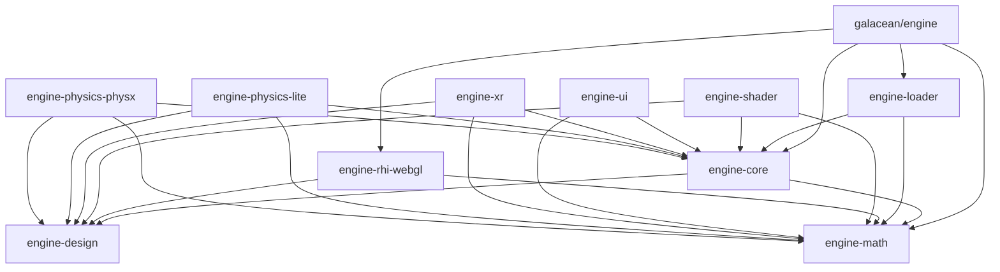

# 系统架构概览

## 项目架构

Galacean Engine 采用 **Monorepo 架构**，使用 pnpm workspace 管理多个相关包。项目遵循分层模块化设计，将引擎功能拆分为独立的包，每个包负责特定的功能领域。

### 架构特点

- **Monorepo 管理**: 使用 pnpm workspace 统一管理所有包
- **分层架构**: 清晰的依赖层次，从底层到高层逐步构建
- **模块化设计**: 每个包都是独立的模块，可单独使用和测试
- **TypeScript 开发**: 全面使用 TypeScript 确保类型安全

## 包组织架构

项目包含 14 个核心包，按功能层次分为四层：

### 1. 核心层 (Core Layer)

- **@galacean/engine-math**: 数学库，提供向量、矩阵等数学计算
- **@galacean/engine-design**: 设计层接口，定义抽象接口和协议
- **@galacean/engine-core**: 引擎核心，实现 ECS 架构、场景管理、渲染管线等

### 2. 渲染层 (Rendering Layer)

- **@galacean/engine-rhi-webgl**: WebGL 渲染硬件接口实现
- **@galacean/engine-shader**: 着色器系统
- **@galacean/engine-shader-lab**: 着色器实验室，高级着色器工具

### 3. 功能扩展层 (Feature Extension Layer)

- **@galacean/engine-loader**: 资源加载器
- **@galacean/engine-ui**: UI 系统
- **@galacean/engine-xr**: XR 扩展基础
- **@galacean/engine-xr-webxr**: WebXR 实现
- **@galacean/engine-physics-lite**: 轻量级物理系统
- **@galacean/engine-physics-physx**: PhysX 物理引擎集成

### 4. 整合层 (Integration Layer)

- **@galacean/engine**: 主包，整合所有功能并提供统一入口

## 架构模式

### 1. ECS (Entity-Component-System) 架构

```typescript
// 实体 (Entity)
const entity = scene.createEntity("Camera");

// 组件 (Component)
entity.addComponent(Transform);
entity.addComponent(Camera);

// 系统 (System) - 在渲染管线中处理
```

ECS 架构提供：
- **高度解耦**: 组件可以独立开发和测试
- **灵活组合**: 通过组合不同组件创建复杂对象
- **数据驱动**: 系统基于组件数据进行处理

### 2. 渲染管线 (Render Pipeline)

```
Scene → Culling → Batching → Rendering → PostProcess
```

渲染管线包含：
- **场景管理**: SceneManager 管理多个场景
- **剔除系统**: 视锥体剔除、遮挡剔除
- **批处理系统**: BatcherManager 优化渲染调用
- **渲染上下文**: RenderContext 管理渲染状态
- **后处理**: PostProcess 处理屏幕效果

### 3. 资源管理 (Resource Management)

```typescript
// 资源加载
const assetPromise = resourceManager.load<Texture2D>("texture.jpg");

// 资源引用管理
class ReferResource {
  refCount: number;
  addRefCount(): void;
  release(): void;
}
```

资源管理特性：
- **引用计数**: 自动管理资源生命周期
- **异步加载**: AssetPromise 处理异步加载
- **缓存机制**: ResourceManager 缓存已加载资源
- **内容恢复**: ContentRestorer 处理资源恢复

### 4. 插件化架构 (Plugin Architecture)

```typescript
// 硬件渲染器插件
interface IHardwareRenderer {
  init(canvas: Canvas): void;
  beginRender(): void;
  endRender(): void;
}

// 物理系统插件
interface IPhysics {
  createPhysicsManager(): IPhysicsManager;
}
```

插件化支持：
- **渲染后端**: 可扩展不同渲染 API
- **物理引擎**: 支持多种物理引擎
- **音频系统**: 可插拔音频实现
- **XR 设备**: 扩展不同 XR 设备支持

## 系统入口点

### WebGLEngine.create()

```typescript
// 主入口
export class Engine extends EventDispatcher {
  constructor(canvas: Canvas, settings?: EngineSettings) {
    super();

    // 初始化子系统
    this._hardwareRenderer = settings?.hardwareRenderer;
    this.inputManager = new InputManager(this);
    this.xrManager = new XRManager(this);
    this.resourceManager = new ResourceManager(this);

    // 初始化渲染管线
    this._batcherManager = new BatcherManager(this);
    this._renderContext = new RenderContext();
  }
}

// 创建引擎实例
const engine = await Engine.create(canvas, {
  hardwareRenderer: new WebGLRenderer(),
  physics: new PhysXPhysics()
});
```

初始化流程：
1. **Canvas 创建**: 获取渲染画布
2. **硬件初始化**: 初始化 WebGL 上下文
3. **子系统创建**: 创建管理器实例
4. **资源加载**: 加载基础资源
5. **事件系统**: 注册事件监听

## 模块间依赖关系



### 依赖层次

1. **基础层**: engine-math, engine-design
   - 提供数学计算和抽象接口
   - 无内部依赖

2. **核心层**: engine-core
   - 依赖基础层
   - 实现 ECS 架构和核心功能

3. **功能层**: 各功能扩展包
   - 依赖核心层和基础层
   - 实现特定功能

4. **集成层**: engine-galacean
   - 依赖所有其他包
   - 提供统一的使用入口

### 循环依赖避免

- **接口分离**: engine-design 定义接口，避免实现层循环依赖
- **事件系统**: 使用事件解耦模块间通信
- **依赖注入**: 通过构造函数注入依赖
- **平台抽象**: 通过接口抽象平台相关实现

## 开发工作流

### 构建系统

```bash
# 开发模式
npm run dev

# 构建 Module
npm run b:module

# 构建 UMD
npm run b:umd

# 构建 Type Definitions
npm run b:types

# 构建所有
npm run b:all
```

### 测试系统

```bash
# 单元测试
npm run test

# E2E 测试
npm run e2e

# 覆盖率测试
npm run coverage
```

### 包管理

- **Workspace**: pnpm workspace 管理多包依赖
- **版本管理**: 统一版本发布，使用 bumpp 工具
- **依赖共享**: workspace 内包使用 workspace:* 协议