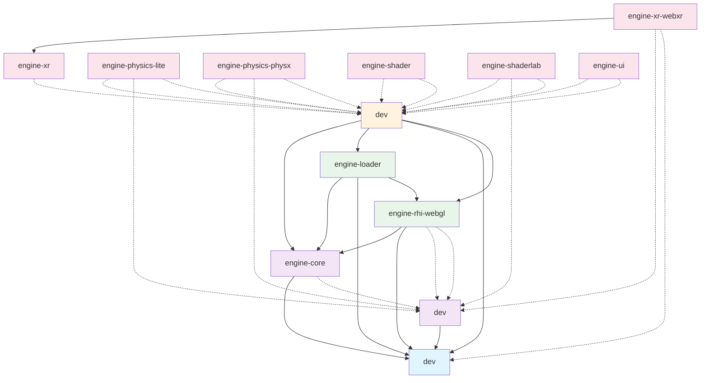

# Galacean Engine 包依赖关系图

本文档描述了 Galacean Engine monorepo 中所有包的依赖关系，包括内部依赖（workspace:*）和外部依赖。

## 包概览

| 包名 | 版本 | 描述 | 依赖类型 |
|------|------|------|----------|
| @galacean/engine-math | 1.6.11 | 数学库 | 基础包（无内部依赖） |
| @galacean/engine-design | 1.6.11 | 设计时工具 | 依赖 math |
| @galacean/engine-core | 1.6.11 | 核心引擎 | 依赖 math |
| @galacean/engine-rhi-webgl | 1.6.11 | WebGL 渲染接口 | 依赖 core, math |
| @galacean/engine-loader | 1.6.11 | 资源加载器 | 依赖 core, math, rhi-webgl |
| @galacean/engine | 1.6.11 | 主引擎包 | 依赖 core, loader, math, rhi-webgl |
| @galacean/engine-xr | 1.6.11 | XR 基础 | peer 依赖 engine |
| @galacean/engine-xr-webxr | 1.6.11 | WebXR 实现 | 依赖 xr |
| @galacean/engine-physics-lite | 1.6.11 | 轻量级物理引擎 | peer 依赖 engine |
| @galacean/engine-physics-physx | 1.6.11 | PhysX 物理引擎 | peer 依赖 engine |
| @galacean/engine-shader | 1.6.11 | 着色器片段 | peer 依赖 engine |
| @galacean/engine-shaderlab | 1.6.11 | 着色器实验室 | peer 依赖 engine |
| @galacean/engine-ui | 1.6.11 | UI 系统 | peer 依赖 engine |

## 依赖关系图

### 完整依赖关系图（Mermaid）

## 依赖层次分析

### 第一层：基础包
- **@galacean/engine-math**
  - 作用：提供数学运算功能（向量、矩阵、四元数等）
  - 无内部依赖，是最底层的包

### 第二层：核心包
- **@galacean/engine-design**
  - 依赖：engine-math
  - 作用：提供设计时工具和类型定义
- **@galacean/engine-core**
  - 依赖：engine-math
  - 作用：引擎的核心功能实现

### 第三层：渲染层
- **@galacean/engine-rhi-webgl**
  - 依赖：engine-core, engine-math
  - dev 依赖：engine-design
  - 作用：WebGL 渲染硬件接口实现
- **@galacean/engine-loader**
  - 依赖：engine-core, engine-math, engine-rhi-webgl
  - 作用：资源加载器，支持各种格式的资源加载

### 第四层：主引擎
- **@galacean/engine**
  - 依赖：engine-core, engine-loader, engine-math, engine-rhi-webgl
  - 作用：完整的引擎包，暴露所有主要功能

### 第五层：扩展包
所有扩展包都通过 peer 依赖与主引擎关联：

- **@galacean/engine-xr**
  - peer 依赖：engine
  - dev 依赖：engine-design, engine
  - 作用：XR 基础功能

- **@galacean/engine-xr-webxr**
  - 依赖：engine-xr
  - dev 依赖：engine-design, engine-math
  - 作用：WebXR 具体实现

- **@galacean/engine-physics-lite**
  - peer 依赖：engine
  - dev 依赖：engine-design, engine
  - 作用：轻量级物理引擎

- **@galacean/engine-physics-physx**
  - peer 依赖：engine
  - dev 依赖：engine-design, engine
  - 作用：NVIDIA PhysX 物理引擎

- **@galacean/engine-shader**
  - peer 依赖：engine
  - dev 依赖：engine
  - 作用：着色器片段系统

- **@galacean/engine-shaderlab**
  - peer 依赖：engine
  - dev 依赖：engine-design, engine
  - 作用：着色器编辑和调试工具

- **@galacean/engine-ui**
  - peer 依赖：engine
  - dev 依赖：engine
  - 作用：UI 系统

## 关键路径分析

### 构建顺序
正确的构建顺序应该是：
1. engine-math
2. engine-design, engine-core（可并行）
3. engine-rhi-webgl, engine-loader（依赖前两步）
4. engine
5. 所有扩展包（可并行）

### 发布顺序
发布顺序应遵循依赖关系：
1. engine-math（最先发布）
2. engine-design, engine-core（第二步）
3. engine-rhi-webgl, engine-loader（第三步）
4. engine（第四步）
5. engine-xr（第五步）
6. engine-xr-webxr（最后，依赖 engine-xr）
7. 其他扩展包（可与 engine-xr 并行发布）

## 循环依赖检测

✅ **无循环依赖**
经过分析，当前包结构中不存在循环依赖：
- 所有依赖关系都是单向的
- 依赖层次清晰，没有形成环形依赖

## 影响分析

### 修改某个包会影响哪些其他包

#### engine-math
**影响范围：最大**
- 直接影响：engine-design, engine-core, engine-rhi-webgl
- 间接影响：engine-loader, engine
- 传递影响：所有扩展包（因为都 peer 依赖 engine）

#### engine-core
**影响范围：较大**
- 直接影响：engine-rhi-webgl, engine-loader
- 间接影响：engine
- 传递影响：所有扩展包

#### engine-rhi-webgl
**影响范围：中等**
- 直接影响：engine-loader, engine
- 传递影响：所有扩展包

#### engine-loader
**影响范围：中等**
- 直接影响：engine
- 传递影响：所有扩展包

#### engine
**影响范围：最大（反向）**
- 所有扩展包都 peer 依赖 engine
- 修改 engine 可能影响所有扩展包的兼容性

#### engine-design
**影响范围：较小**
- 主要是 dev 依赖
- 影响开发时的类型定义和工具

#### engine-xr
**影响范围：小**
- 仅影响 engine-xr-webxr

## 最佳实践建议

1. **版本管理**
   - 所有包应保持版本同步
   - 使用 workspace:* 确保内部依赖始终使用最新版本

2. **依赖管理**
   - 避免在扩展包中直接依赖核心包（除了 peer 依赖 engine）
   - 使用 peer 依赖减少包体积和版本冲突

3. **构建优化**
   - 利用依赖层次进行并行构建
   - engine-math 可以独立构建和测试

4. **发布策略**
   - 按照依赖顺序发布
   - 考虑使用自动化工具确保发布顺序正确

5. **测试策略**
   - 每个包都应有独立的单元测试
   - 集成测试应覆盖关键的依赖路径
